# Tugas Week 9 — Modul 1: Docker dan Instalasi

| | |
|---|---|
| **Mata Kuliah** | Workshop Administrasi Jaringan |
| **Nama** | Irwin Ahmad Wiryawan |
| **Kelas** | D4 IT B |
| **NRP** | 3124600035 |
| **Dosen Pengampu** | Dr Ferry Astika Saputra ST, M.Sc |

---

## PRE LAB

### 1. Sebutkan minimal 3 perbedaan antara Virtual Machine dan Container.

- Virtual Machine menjalankan guest OS sendiri, sedangkan container menggunakan shared kernel dari host OS.
- Virtual Machine memiliki ukuran lebih besar karena membawa satu sistem operasi penuh, sedangkan container lebih ringan karena hanya membawa aplikasi dan dependency.
- Startup Virtual Machine membutuhkan waktu menit, sedangkan container dapat berjalan dalam hitungan detik.
- Virtual Machine memiliki overhead lebih tinggi karena menggunakan hypervisor, sedangkan container memiliki overhead rendah karena berjalan langsung di kernel host.
- Container lebih cocok untuk microservices dan scaling cepat, sedangkan Virtual Machine cocok untuk isolasi penuh dan multi-OS.

### 2. Apa fungsi dari containerd dan runc dalam arsitektur Docker?

- `containerd` berfungsi sebagai container runtime yang mengelola lifecycle container seperti create, start, stop, dan delete.
- `runc` merupakan low-level runtime yang bertugas membuat dan menjalankan container sesuai spesifikasi OCI (Open Container Initiative).
- Docker Daemon menggunakan `containerd`, lalu `containerd` menggunakan `runc` untuk menjalankan container secara langsung di kernel Linux.

### 3. Mengapa Docker membutuhkan kernel Linux? Bagaimana Docker Desktop di Windows mengatasi hal ini?

Docker membutuhkan kernel Linux karena container menggunakan fitur Linux kernel seperti namespaces, cgroups, dan union filesystem untuk melakukan isolasi proses dan resource. Pada Windows, Docker Desktop menggunakan WSL2 (Windows Subsystem for Linux 2) yang menjalankan kernel Linux asli di lightweight virtual machine sehingga container tetap dapat berjalan secara native.

### 4. Apa keuntungan layered filesystem pada Docker Image?

Layered filesystem memungkinkan setiap layer image digunakan kembali oleh image lain yang memiliki base sama. Hal ini menghemat penggunaan storage dan bandwidth karena layer yang sama tidak perlu di-download ulang. Selain itu, proses build menjadi lebih cepat karena Docker hanya rebuild layer yang berubah.

### 5. Jelaskan perbedaan antara `docker run` dan `docker exec`.

- `docker run` digunakan untuk membuat dan menjalankan container baru dari sebuah image.
- `docker exec` digunakan untuk menjalankan perintah tambahan pada container yang sudah berjalan.
- `docker run` membuat instance container baru, sedangkan `docker exec` hanya masuk atau menjalankan command pada container existing.

---

## LANGKAH PRAKTIKUM

### Langkah 0: Persiapan Environment

Pastikan VM/Host sudah terkoneksi internet untuk download image dari Docker Hub.

```bash
# Cek koneksi internet
ping -c 3 google.com
```

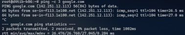
*Gambar 0.1: Screenshot hasil perintah `ping -c 3 google.com` menunjukkan koneksi internet berhasil.*

```bash
# Update package list
sudo apt update && sudo apt upgrade -y
```

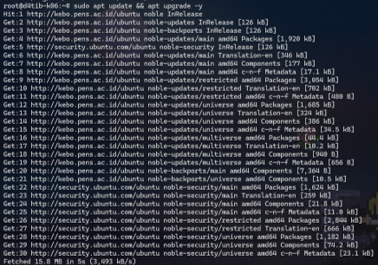
*Gambar 0.2: Screenshot hasil `sudo apt update && sudo apt upgrade -y` menunjukkan package list berhasil diperbarui.*

---

### Langkah 1: Instalasi Docker Engine di Ubuntu 22.04

#### 1.1 Hapus versi lama (jika ada)

```bash
# Hapus package Docker versi lama yang mungkin terinstal
sudo apt remove -y docker docker-engine docker.io containerd runc 2>/dev/null
```

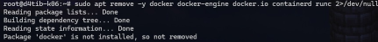
*Gambar 1.1: Screenshot hasil `sudo apt remove` package Docker versi lama.*

#### 1.2 Instal dependensi

```bash
sudo apt install -y \
  ca-certificates \
  curl \
  gnupg \
  lsb-release
```

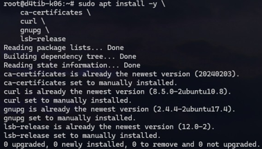
*Gambar 1.2: Screenshot hasil instalasi dependensi (ca-certificates, curl, gnupg, lsb-release).*

#### 1.3 Tambahkan Docker GPG key dan repository

```bash
# Buat direktori keyrings
sudo install -m 0755 -d /etc/apt/keyrings
```

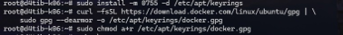
*Gambar 1.3: Screenshot hasil pembuatan direktori `/etc/apt/keyrings`.*

```bash
# Download GPG key Docker
curl -fsSL https://download.docker.com/linux/ubuntu/gpg | \
  sudo gpg --dearmor -o /etc/apt/keyrings/docker.gpg
sudo chmod a+r /etc/apt/keyrings/docker.gpg
```


*Gambar 1.4: Screenshot hasil download GPG key Docker dan pengaturan permission.*

```bash
# Tambahkan repository Docker
echo \
  "deb [arch=$(dpkg --print-architecture) signed-by=/etc/apt/keyrings/docker.gpg] \
  https://download.docker.com/linux/ubuntu \
  $(lsb_release -cs) stable" | \
  sudo tee /etc/apt/sources.list.d/docker.list > /dev/null
```

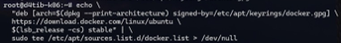
*Gambar 1.5: Screenshot setelah menambahkan Docker repository ke sources.list.*

#### 1.4 Instal Docker Engine

```bash
sudo apt update
```

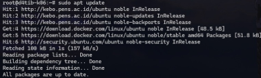
*Gambar 1.6: Screenshot hasil `sudo apt update` setelah repository Docker ditambahkan.*

```bash
sudo apt install -y \
  docker-ce \
  docker-ce-cli \
  containerd.io \
  docker-buildx-plugin \
  docker-compose-plugin
```

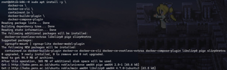
*Gambar 1.7: Screenshot hasil instalasi Docker Engine dan plugin.*

#### 1.5 Konfigurasi user non-root

```bash
# Tambahkan user saat ini ke group docker
sudo usermod -aG docker $USER
```


*Gambar 1.8: Screenshot hasil `sudo usermod -aG docker $USER`.*

```bash
# Aktifkan group baru (atau logout/login)
newgrp docker
```

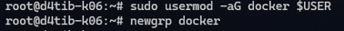
*Gambar 1.9: Screenshot hasil `newgrp docker`.*

#### 1.6 Verifikasi instalasi

```bash
# Cek versi Docker
docker version
```

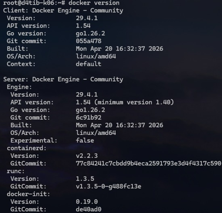
*Gambar 1.10: Screenshot hasil `docker version` menampilkan versi client dan server Docker.*

```bash
# Cek info Docker Engine
docker info
```

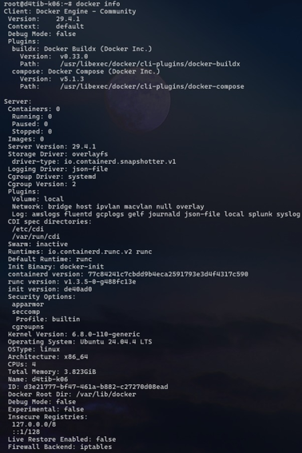
*Gambar 1.11: Screenshot hasil `docker info` menampilkan informasi detail Docker Engine.*

```bash
# Pastikan service berjalan
sudo systemctl status docker
```

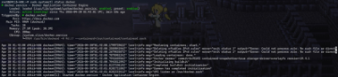
*Gambar 1.12: Screenshot hasil `sudo systemctl status docker` menunjukkan service Docker aktif (running).*

```bash
# Test container pertama
docker run hello-world
```

**Expected output:**
```
Hello from Docker!
This message shows that your installation appears to be working correctly.
```

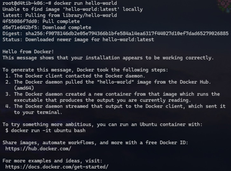
*Gambar 1.13: Screenshot hasil `docker run hello-world` menampilkan pesan sukses dari Docker.*

---

### Langkah 2: Instalasi Docker Desktop di Windows 10/11

#### 2.1 Aktifkan WSL2

Buka PowerShell sebagai Administrator:

```powershell
# Aktifkan WSL
wsl --install

# Set WSL2 sebagai default
wsl --set-default-version 2

# Verifikasi
wsl --list --verbose
```

> Restart komputer jika diminta.

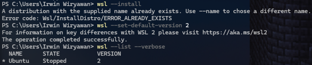
*Gambar 2.1: Screenshot PowerShell menunjukkan hasil `wsl --install`, `wsl --set-default-version 2`, dan `wsl --list --verbose`.*

#### 2.2 Download dan Instal Docker Desktop

1. Buka https://www.docker.com/products/docker-desktop/
2. Download Docker Desktop for Windows
3. Jalankan installer, centang **"Use WSL 2 instead of Hyper-V"**
4. Klik Install → tunggu selesai → Restart jika diminta

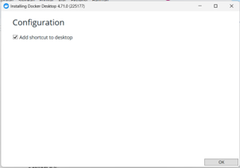
*Gambar 2.2: Screenshot installer Docker Desktop for Windows dengan opsi "Use WSL 2 instead of Hyper-V" dicentang.*

#### 2.3 Konfigurasi Docker Desktop

1. Buka Docker Desktop dari Start Menu
2. Masuk ke **Settings → General** → pastikan **"Use the WSL 2 based engine"** aktif


*Gambar 2.3: Screenshot Docker Desktop Settings → General dengan "Use the WSL 2 based engine" dalam keadaan aktif.*

3. Masuk ke **Settings → Resources → WSL Integration** → aktifkan distro yang diinginkan

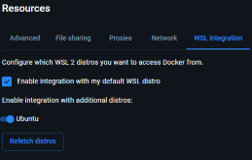
*Gambar 2.4: Screenshot Docker Desktop Settings → Resources → WSL Integration dengan distro Ubuntu terpilih.*

#### 2.4 Verifikasi dari PowerShell / WSL Terminal

```powershell
# Dari PowerShell
docker version
```

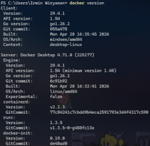
*Gambar 2.5: Screenshot hasil `docker version` dari PowerShell.*

```powershell
docker run hello-world
```

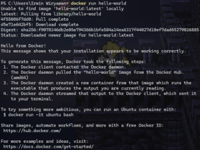
*Gambar 2.6: Screenshot hasil `docker run hello-world` dari PowerShell.*

```bash
# Dari WSL terminal (Ubuntu)
docker version
```

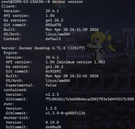
*Gambar 2.7: Screenshot hasil `docker version` dari terminal WSL Ubuntu.*

```bash
docker run hello-world
```

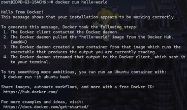
*Gambar 2.8: Screenshot hasil `docker run hello-world` dari terminal WSL Ubuntu.*

---

### Langkah 3: Operasi Dasar Docker Image

#### 3.1 Pull image dari Docker Hub

```bash
# Pull image nginx versi latest
docker pull nginx
```

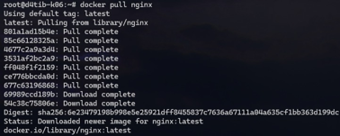
*Gambar 3.1: Screenshot hasil `docker pull nginx` menunjukkan layer-layer image berhasil di-download.*

```bash
# Pull image nginx versi spesifik
docker pull nginx:1.26
```

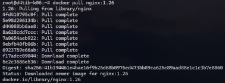
*Gambar 3.2: Screenshot hasil `docker pull nginx:1.26`.*

```bash
# Pull image Ubuntu 22.04
docker pull ubuntu:22.04
```

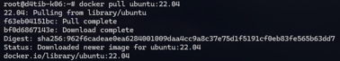
*Gambar 3.3: Screenshot hasil `docker pull ubuntu:22.04`.*

```bash
# Pull image Alpine (sangat ringan, ~7MB)
docker pull alpine:3.20
```

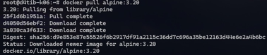
*Gambar 3.4: Screenshot hasil `docker pull alpine:3.20` — perhatikan ukurannya yang hanya ~7MB.*

#### 3.2 Manajemen image

```bash
# List semua image lokal
docker images
```


*Gambar 3.5: Screenshot hasil `docker images` menampilkan semua image yang tersimpan secara lokal.*

```bash
# List dengan format custom
docker images --format "table {{.Repository}}\t{{.Tag}}\t{{.Size}}"
```

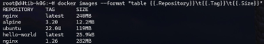
*Gambar 3.6: Screenshot hasil `docker images` dengan format custom menampilkan Repository, Tag, dan Size.*

```bash
# Inspect detail image
docker image inspect nginx
```

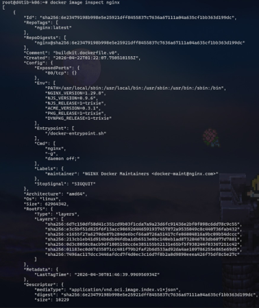
*Gambar 3.7: Screenshot hasil `docker image inspect nginx` menampilkan detail metadata image dalam format JSON.*

```bash
# Lihat history layer sebuah image
docker image history nginx
```

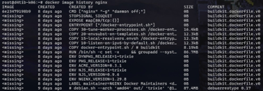
*Gambar 3.8: Screenshot hasil `docker image history nginx` menampilkan layer-layer penyusun image.*

```bash
# Hapus image
docker rmi alpine:3.20

# Hapus semua image yang tidak digunakan
docker image prune -a
```

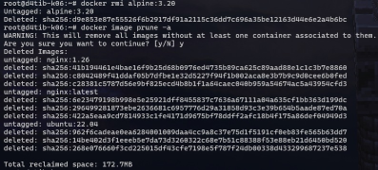
*Gambar 3.9: Screenshot hasil `docker rmi alpine:3.20` menghapus image Alpine dan `docker image prune -a` menghapus semua image yang tidak digunakan.*

---

### Langkah 4: Menjalankan dan Mengelola Container

#### 4.1 Menjalankan container dasar

```bash
# Jalankan container nginx (foreground — tekan Ctrl+C untuk stop)
docker run nginx
```

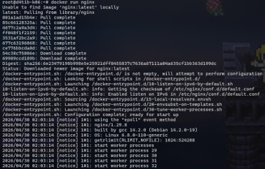
*Gambar 4.1: Screenshot hasil `docker run nginx` (foreground mode) — log Nginx tampil di terminal.*

```bash
# Jalankan nginx di background (detached mode)
docker run -d --name web-server nginx
```

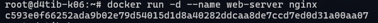
*Gambar 4.2: Screenshot hasil `docker run -d --name web-server nginx` — container ID ditampilkan.*

```bash
# Jalankan nginx dengan port mapping (host:container)
docker run -d --name web-public -p 8080:80 nginx
```

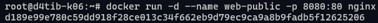
*Gambar 4.3: Screenshot hasil `docker run -d --name web-public -p 8080:80 nginx`.*

> Buka browser ke http://localhost:8080 → akan tampil halaman default Nginx.

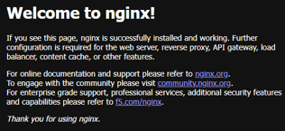
*Gambar 4.4: Screenshot browser di http://localhost:8080 menampilkan halaman default Nginx ("Welcome to nginx!").*

#### 4.2 Container interaktif

```bash
# Jalankan Ubuntu container dengan bash interaktif
docker run -it --name ubuntu-test ubuntu:22.04 /bin/bash
```

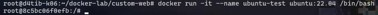
*Gambar 4.5: Screenshot hasil `docker run -it --name ubuntu-test ubuntu:22.04 /bin/bash` masuk ke shell container.*

```bash
# Di dalam container:
cat /etc/os-release
```

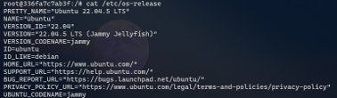
*Gambar 4.6: Screenshot hasil `cat /etc/os-release` di dalam container Ubuntu.*

```bash
apt update && apt install -y curl
```

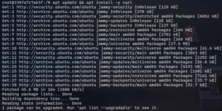
*Gambar 4.7: Screenshot hasil `apt update && apt install -y curl` di dalam container.*

```bash
curl http://web-server  # akses container lain (jika di network sama)
```

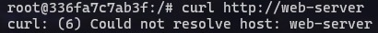
*Gambar 4.8: Screenshot hasil `curl http://web-server` mengakses container Nginx dari dalam container Ubuntu.*

```bash
exit  # keluar (container akan stop)
```

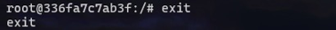
*Gambar 4.9: Screenshot setelah mengetik `exit` — kembali ke shell host dan container berhenti.*

#### 4.3 Monitoring container

```bash
# List container yang sedang berjalan
docker ps
```


*Gambar 4.10: Screenshot hasil `docker ps` menampilkan container yang sedang berjalan.*

```bash
# List SEMUA container (termasuk stopped)
docker ps -a
```


*Gambar 4.11: Screenshot hasil `docker ps -a` menampilkan semua container termasuk yang sudah berhenti.*

```bash
# Lihat log container
docker logs web-server
```

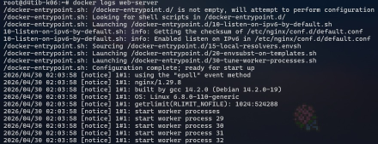
*Gambar 4.12: Screenshot hasil `docker logs web-server` menampilkan log akses Nginx.*

```bash
docker logs -f web-server      # follow (real-time)
docker logs --tail 20 web-server  # 20 baris terakhir
```

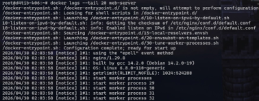
*Gambar 4.13: Screenshot hasil `docker logs -f web-server` (kiri) dan `docker logs --tail 20 web-server` (kanan).*

```bash
# Lihat resource usage (CPU, Memory, I/O)
docker stats
```


*Gambar 4.14: Screenshot hasil `docker stats` menampilkan penggunaan CPU, Memory, dan I/O container secara real-time.*

```bash
# Lihat detail container
docker inspect web-server
```

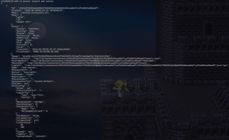
*Gambar 4.15: Screenshot hasil `docker inspect web-server` menampilkan detail konfigurasi container dalam format JSON.*

#### 4.4 Interaksi dengan container berjalan

```bash
# Eksekusi perintah di container yang sedang berjalan
docker exec web-server cat /etc/nginx/nginx.conf
```

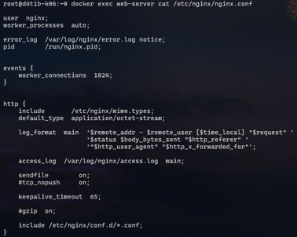
*Gambar 4.16: Screenshot hasil `docker exec web-server cat /etc/nginx/nginx.conf` menampilkan isi file konfigurasi Nginx.*

```bash
# Masuk ke shell container yang sedang berjalan
docker exec -it web-server /bin/bash
```

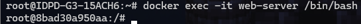
*Gambar 4.17: Screenshot hasil `docker exec -it web-server /bin/bash` masuk ke shell container yang sedang berjalan.*

```bash
# Copy file dari host ke container
docker cp index.html web-server:/usr/share/nginx/html/index.html
```

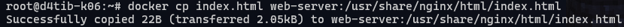
*Gambar 4.18: Screenshot hasil `docker cp index.html web-server:/usr/share/nginx/html/index.html`.*

```bash
# Copy file dari container ke host
docker cp web-server:/etc/nginx/nginx.conf ./nginx.conf
```

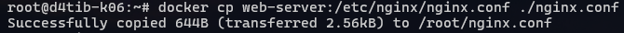
*Gambar 4.19: Screenshot hasil `docker cp web-server:/etc/nginx/nginx.conf ./nginx.conf`.*

#### 4.5 Lifecycle management

```bash
# Stop container
docker stop web-server

# Start container yang sudah di-stop
docker start web-server

# Restart container
docker restart web-server

# Kill container (force stop — SIGKILL)
docker kill web-server

# Hapus container (harus dalam keadaan stopped)
docker stop web-server && docker rm web-server

# Hapus container secara paksa (meskipun masih running)
docker rm -f web-server
```

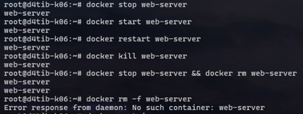
*Gambar 4.20: Screenshot rangkaian perintah lifecycle container: stop, start, restart, kill, rm.*

```bash
# Hapus SEMUA stopped container
docker container prune
```

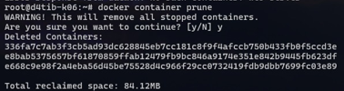
*Gambar 4.21: Screenshot hasil `docker container prune` menghapus semua container yang sudah berhenti.*

---

### Langkah 5: Membuat Custom Image dengan Dockerfile

#### 5.1 Buat project directory

```bash
mkdir -p ~/docker-lab/custom-web && cd ~/docker-lab/custom-web
```

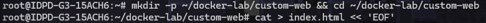
*Gambar 5.1: Screenshot hasil `mkdir -p ~/docker-lab/custom-web && cd ~/docker-lab/custom-web`.*

#### 5.2 Buat halaman web

```bash
cat > index.html << 'EOF'
<!DOCTYPE html>
<html lang="id">
<head>
  <meta charset="UTF-8">
  <title>Docker Lab - PENS</title>
  <style>
    body { font-family: Arial, sans-serif; text-align: center; padding: 50px;
           background: linear-gradient(135deg, #667eea 0%, #764ba2 100%);
           color: white; }
    .container { background: rgba(255,255,255,0.1); border-radius: 15px;
                 padding: 40px; max-width: 600px; margin: 0 auto; }
    h1 { font-size: 2.5em; }
    .info { background: rgba(0,0,0,0.2); padding: 15px; border-radius: 8px;
            margin-top: 20px; text-align: left; }
  </style>
</head>
<body>
  <div class="container">
    <h1>🐳 Docker Lab PENS</h1>
    <p>Container berhasil berjalan!</p>
    <div class="info">
      <p><strong>Hostname:</strong> <span id="host"></span></p>
      <p><strong>Server:</strong> Nginx on Docker</p>
      <p><strong>Praktikum:</strong> Modul 1 — Instalasi Docker</p>
    </div>
  </div>
  <script>
    document.getElementById('host').textContent = location.hostname;
  </script>
</body>
</html>
EOF
```

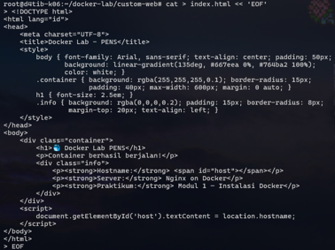
*Gambar 5.2: Screenshot hasil pembuatan file `index.html` dengan heredoc.*

#### 5.3 Buat Dockerfile

```bash
cat > Dockerfile << 'EOF'
# Gunakan base image nginx versi stabil
FROM nginx:1.26-alpine

# Metadata
LABEL maintainer="admin@pens.ac.id"
LABEL description="Custom Nginx untuk praktikum Docker PENS"
LABEL version="1.0"

# Hapus halaman default dan ganti dengan halaman custom
RUN rm -rf /usr/share/nginx/html/*
COPY index.html /usr/share/nginx/html/index.html

# Expose port 80
EXPOSE 80

# Command default (inherited dari base image, tapi kita tulis eksplisit)
CMD ["nginx", "-g", "daemon off;"]
EOF
```

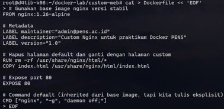
*Gambar 5.3: Screenshot hasil pembuatan file `Dockerfile`.*

#### 5.4 Build dan jalankan

```bash
# Build image (titik di akhir = build context = direktori saat ini)
docker build -t pens-web:1.0 .
```

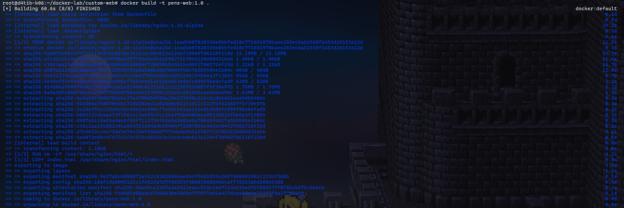
*Gambar 5.4: Screenshot hasil `docker build -t pens-web:1.0 .` — setiap step Dockerfile dieksekusi.*

```bash
# Verifikasi image berhasil dibuat
docker images | grep pens-web
```


*Gambar 5.5: Screenshot hasil `docker images | grep pens-web` menunjukkan image `pens-web:1.0` berhasil dibuat.*

```bash
# Jalankan container dari image custom
docker run -d --name pens-app -p 9090:80 pens-web:1.0
```


*Gambar 5.6: Screenshot hasil `docker run -d --name pens-app -p 9090:80 pens-web:1.0`.*

```bash
# Test
curl http://localhost:9090
```

> Buka browser ke http://localhost:9090.


*Gambar 5.7: Screenshot hasil `curl http://localhost:9090` menampilkan halaman HTML custom.*


*Gambar 5.8: Screenshot browser di http://localhost:9090 menampilkan halaman "Docker Lab PENS" dengan gradient background.*

#### 5.5 Lihat layer image

```bash
# Bandingkan layer antara base image dan custom image
docker image history nginx:1.26-alpine
```


*Gambar 5.9: Screenshot hasil `docker image history nginx:1.26-alpine` — layer-layer base image.*

```bash
docker image history pens-web:1.0
```


*Gambar 5.10: Screenshot hasil `docker image history pens-web:1.0` — bandingkan dengan base image, layer tambahan terlihat.*

---

### Langkah 6: Docker System Cleanup

```bash
# Lihat disk usage Docker
docker system df
```


*Gambar 6.1: Screenshot hasil `docker system df` menampilkan penggunaan disk oleh Images, Containers, Local Volumes, dan Build Cache.*

```bash
# Lihat detail disk usage
docker system df -v
```


*Gambar 6.2: Screenshot hasil `docker system df -v` menampilkan detail penggunaan disk per resource.*

```bash
# Hapus semua resource yang tidak digunakan (container, image, network, cache)
docker system prune -a
```


*Gambar 6.3: Screenshot hasil `docker system prune -a` — konfirmasi penghapusan dan jumlah space yang dibebaskan.*

```bash
# Konfirmasi dengan -f (force, tanpa prompt)
docker system prune -a -f
```


*Gambar 6.4: Screenshot hasil `docker system prune -a -f` — pembersihan selesai tanpa prompt konfirmasi.*

---

## POST LAB

### 1. Bandingkan output `docker image history nginx` dengan `docker image history pens-web:1.0`. Layer mana saja yang di-share?

Image `pens-web:1.0` menggunakan `nginx:1.26-alpine` sebagai base image sehingga seluruh layer dasar dari image nginx di-share. Layer tambahan pada `pens-web:1.0` hanya berasal dari instruksi custom seperti `COPY index.html` dan `RUN rm -rf /usr/share/nginx/html/*`. Dengan demikian, Docker tidak menduplikasi layer nginx yang sudah ada sebelumnya.

### 2. Apa yang terjadi pada data di dalam container setelah container dihapus dengan `docker rm`? Bagaimana solusinya?

Data yang berada di writable layer container akan hilang ketika container dihapus menggunakan `docker rm`. Hal ini terjadi karena filesystem container bersifat ephemeral. Solusinya adalah menggunakan **Docker Volume** atau **bind mount** agar data disimpan di luar container sehingga tetap persisten meskipun container dihapus atau dibuat ulang.

### 3. Jelaskan perbedaan antara `EXPOSE` di Dockerfile dan flag `-p` pada `docker run`. Apakah `EXPOSE` cukup untuk membuat port dapat diakses dari host?

- `EXPOSE` pada Dockerfile hanya berfungsi sebagai dokumentasi bahwa container menggunakan port tertentu.
- Flag `-p` pada `docker run` digunakan untuk melakukan port mapping dari host ke container.
- `EXPOSE` saja **tidak cukup** agar port dapat diakses dari host. Agar service bisa diakses dari luar container, tetap diperlukan `-p host_port:container_port`.

### 4. Mengapa menggunakan tag spesifik (misal `nginx:1.26`) lebih baik daripada `nginx:latest` untuk production?

Tag spesifik memberikan versi yang konsisten sehingga deployment menjadi reproducible dan stabil. Jika menggunakan `latest`, versi image dapat berubah sewaktu-waktu sehingga berpotensi menyebabkan bug, incompatibility, atau perubahan behavior tanpa disadari saat deployment ulang.

### 5. Berapa ukuran image `alpine:3.20` dibanding `ubuntu:22.04`? Apa trade-off menggunakan Alpine?

Image `alpine:3.20` berukuran sekitar **7 MB**, sedangkan `ubuntu:22.04` dapat mencapai **ratusan MB**. Keuntungan Alpine adalah ukuran image jauh lebih kecil sehingga pull dan deployment lebih cepat. Trade-off-nya adalah Alpine menggunakan `musl libc` dan `busybox` sehingga beberapa package atau aplikasi tertentu mungkin kurang kompatibel dibanding Ubuntu yang menggunakan `glibc`.

---

---

*Laporan ini dibuat sebagai bagian dari praktikum Workshop Administrasi Jaringan, Program Studi D4 Teknik Informatika, Politeknik Elektronika Negeri Surabaya (PENS), 2026.*
