# Tugas Week 9 — Modul 4: Database PostgreSQL

| | |
|---|---|
| **Mata Kuliah** | Workshop Administrasi Jaringan |
| **Nama** | Irwin Ahmad Wiryawan |
| **Kelas** | D4 IT B |
| **NRP** | 3124600035 |
| **Dosen Pengampu** | Dr Ferry Astika Saputra ST, M.Sc |

---

## PRE LAB

### 1. Apa fungsi file/folder `/docker-entrypoint-initdb.d/` di image PostgreSQL?

Folder `/docker-entrypoint-initdb.d/` digunakan untuk menyimpan file inisialisasi seperti `.sql` atau `.sh` yang akan dijalankan otomatis saat PostgreSQL container pertama kali dibuat dengan volume kosong. Folder ini biasanya digunakan untuk membuat schema, tabel, user, insert sample data, atau konfigurasi awal database secara otomatis.

### 2. Mengapa `POSTGRES_PASSWORD` wajib diset? Apa risikonya jika tidak ada password?

`POSTGRES_PASSWORD` wajib diset untuk mengamankan akses superuser PostgreSQL. Tanpa password, database dapat diakses tanpa autentikasi yang aman sehingga meningkatkan risiko unauthorized access, data leakage, dan pengambilalihan database oleh pihak tidak sah. PostgreSQL image resmi juga secara default menolak startup tanpa password untuk mencegah insecure deployment.

### 3. Jelaskan perbedaan antara `pg_dump` format custom (`-Fc`) dan format SQL plain text.

- Format custom (`-Fc`) menghasilkan file backup binary terkompresi yang lebih kecil dan mendukung selective restore menggunakan `pg_restore`.
- Format SQL plain text menghasilkan file `.sql` berisi statement SQL yang dapat dibaca manusia dan dijalankan langsung menggunakan `psql`.
- Format custom lebih fleksibel dan efisien untuk backup besar, sedangkan plain SQL lebih mudah untuk inspeksi manual atau migrasi sederhana.

### 4. Apa itu `shared_buffers` dan mengapa perlu disesuaikan untuk container?

`shared_buffers` adalah memory cache internal PostgreSQL yang digunakan untuk menyimpan halaman data yang sering diakses agar query lebih cepat. Pada container, nilai `shared_buffers` perlu disesuaikan dengan resource host karena container biasanya memiliki RAM terbatas. Jika terlalu besar, container dapat mengalami memory pressure atau OOM kill, sedangkan jika terlalu kecil performa query dapat menurun.

### 5. Mengapa data PostgreSQL harus disimpan di Docker Volume, bukan di container layer?

Karena filesystem container bersifat ephemeral sehingga data akan hilang ketika container dihapus atau dibuat ulang. Docker Volume menyediakan persistent storage yang tetap ada meskipun container restart, recreate, atau update image. Volume juga lebih aman dan optimal untuk workload database dibanding writable layer container.

---

## LANGKAH PRAKTIKUM

### Langkah 0: Persiapan Project

```bash
mkdir -p ~/docker-lab/postgresql/{init,config,backup}
cd ~/docker-lab/postgresql
```

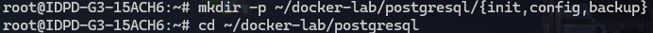
*Gambar 0.1: Screenshot hasil `mkdir -p ~/docker-lab/postgresql/{init,config,backup}` dan `cd ~/docker-lab/postgresql`.*

---

### Langkah 1: Deploy PostgreSQL dengan Docker Compose

#### 1.1 Buat init script (dijalankan saat pertama kali)

```bash
cat > init/01-create-schema.sql << 'EOF'
-- ==============================================
-- Init Script: Database Schema untuk Lab PENS
-- Dijalankan otomatis saat container pertama kali start
-- ==============================================

-- Buat database tambahan
CREATE DATABASE inventory_db;

-- Gunakan database utama (labdb sudah dibuat via env)
\c labdb

-- Buat schema
CREATE SCHEMA IF NOT EXISTS app;

-- Tabel: Mahasiswa
CREATE TABLE app.mahasiswa (
    id SERIAL PRIMARY KEY,
    nrp VARCHAR(15) UNIQUE NOT NULL,
    nama VARCHAR(100) NOT NULL,
    kelas CHAR(1) CHECK (kelas IN ('A', 'B', 'C', 'D')),
    kelompok INTEGER CHECK (kelompok BETWEEN 1 AND 10),
    email VARCHAR(100),
    created_at TIMESTAMP DEFAULT CURRENT_TIMESTAMP
);

-- Tabel: Mata Kuliah
CREATE TABLE app.matakuliah (
    id SERIAL PRIMARY KEY,
    kode VARCHAR(10) UNIQUE NOT NULL,
    nama VARCHAR(100) NOT NULL,
    sks INTEGER CHECK (sks BETWEEN 1 AND 6)
);

-- Tabel: Nilai (relasi many-to-many)
CREATE TABLE app.nilai (
    id SERIAL PRIMARY KEY,
    mahasiswa_id INTEGER REFERENCES app.mahasiswa(id) ON DELETE CASCADE,
    matakuliah_id INTEGER REFERENCES app.matakuliah(id) ON DELETE CASCADE,
    nilai_angka NUMERIC(5,2) CHECK (nilai_angka BETWEEN 0 AND 100),
    grade CHAR(2),
    semester VARCHAR(10),
    UNIQUE(mahasiswa_id, matakuliah_id, semester)
);

-- Tabel: Log Aktivitas (untuk Modul 5 logging)
CREATE TABLE app.activity_log (
    id BIGSERIAL PRIMARY KEY,
    timestamp TIMESTAMP DEFAULT CURRENT_TIMESTAMP,
    level VARCHAR(10) DEFAULT 'INFO',
    source VARCHAR(50),
    message TEXT,
    metadata JSONB
);

-- Index untuk performa query
CREATE INDEX idx_mahasiswa_kelas ON app.mahasiswa(kelas);
CREATE INDEX idx_mahasiswa_nrp ON app.mahasiswa(nrp);
CREATE INDEX idx_nilai_semester ON app.nilai(semester);
CREATE INDEX idx_activity_log_timestamp ON app.activity_log(timestamp);
CREATE INDEX idx_activity_log_level ON app.activity_log(level);
CREATE INDEX idx_activity_log_metadata ON app.activity_log USING GIN(metadata);

-- Insert sample data
INSERT INTO app.matakuliah (kode, nama, sks) VALUES
    ('JAR01', 'Administrasi Jaringan', 3),
    ('SBD01', 'Sistem Basis Data', 3),
    ('SO01', 'Sistem Operasi', 2),
    ('WEB01', 'Pemrograman Web', 3);

INSERT INTO app.mahasiswa (nrp, nama, kelas, kelompok, email) VALUES
    ('3122600001', 'Ahmad Fauzi', 'A', 1, 'ahmad@student.pens.ac.id'),
    ('3122600002', 'Budi Santoso', 'A', 1, 'budi@student.pens.ac.id'),
    ('3122600003', 'Citra Dewi', 'B', 2, 'citra@student.pens.ac.id'),
    ('3122600004', 'Dian Pratama', 'B', 2, 'dian@student.pens.ac.id'),
    ('3122600005', 'Eka Putra', 'C', 3, 'eka@student.pens.ac.id');

INSERT INTO app.nilai (mahasiswa_id, matakuliah_id, nilai_angka, grade, semester) VALUES
    (1, 1, 85.50, 'A', '2025-1'),
    (1, 2, 78.00, 'B+', '2025-1'),
    (2, 1, 92.00, 'A', '2025-1'),
    (3, 1, 70.25, 'B', '2025-1'),
    (4, 3, 88.75, 'A', '2025-1');

-- Buat read-only user untuk aplikasi
CREATE USER app_reader WITH PASSWORD 'reader123';
GRANT USAGE ON SCHEMA app TO app_reader;
GRANT SELECT ON ALL TABLES IN SCHEMA app TO app_reader;
ALTER DEFAULT PRIVILEGES IN SCHEMA app GRANT SELECT ON TABLES TO app_reader;

RAISE NOTICE 'Database initialization completed successfully!';
EOF
```

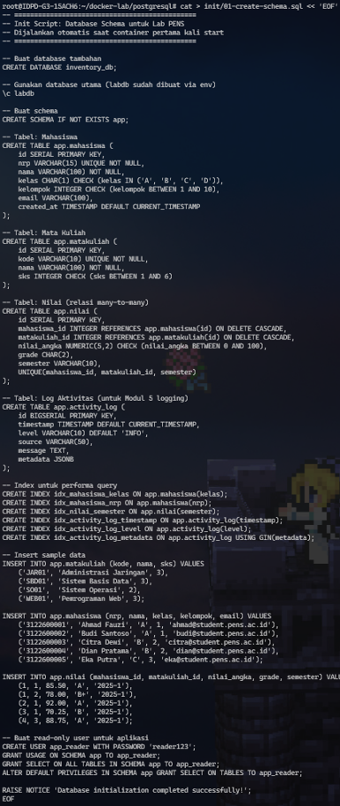
*Gambar 1.1: Screenshot hasil pembuatan file `init/01-create-schema.sql` dengan heredoc.*

#### 1.2 Buat custom PostgreSQL config

```bash
cat > config/custom-postgresql.conf << 'EOF'
# ==============================================
# Custom PostgreSQL Configuration untuk Lab
# ==============================================

# Connection
listen_addresses = '*'
max_connections = 50

# Memory (sesuaikan untuk container dengan RAM terbatas)
shared_buffers = 128MB
work_mem = 4MB
maintenance_work_mem = 64MB
effective_cache_size = 256MB

# WAL & Checkpoint
wal_level = replica
max_wal_size = 256MB
min_wal_size = 64MB

# Logging
logging_collector = on
log_directory = '/var/log/postgresql'
log_filename = 'postgresql-%Y-%m-%d.log'
log_statement = 'mod'
log_min_duration_statement = 1000
log_connections = on
log_disconnections = on
log_line_prefix = '%t [%p] %u@%d '

# Locale & Timezone
timezone = 'Asia/Jakarta'
log_timezone = 'Asia/Jakarta'
EOF
```

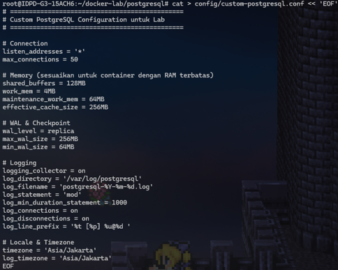
*Gambar 1.2: Screenshot hasil pembuatan file `config/custom-postgresql.conf`.*

#### 1.3 Buat Docker Compose

```bash
cat > docker-compose.yml << 'EOF'
services:

  # --- PostgreSQL 16 ---
  db:
    image: postgres:16-alpine
    container_name: postgres-db
    environment:
      POSTGRES_DB: labdb
      POSTGRES_USER: labuser
      POSTGRES_PASSWORD: labpass123
      TZ: Asia/Jakarta
    ports:
      - "5432:5432"
    volumes:
      - pg-data:/var/lib/postgresql/data
      - ./init:/docker-entrypoint-initdb.d:ro
      - ./config/custom-postgresql.conf:/etc/postgresql/custom.conf:ro
      - ./backup:/backup
      - pg-logs:/var/log/postgresql
    command: >
      postgres
      -c config_file=/etc/postgresql/custom.conf
      -c hba_file=/var/lib/postgresql/data/pg_hba.conf
    networks:
      - db-net
    healthcheck:
      test: ["CMD-SHELL", "pg_isready -U labuser -d labdb"]
      interval: 10s
      timeout: 5s
      retries: 5
    restart: unless-stopped

  # --- pgAdmin 4 (GUI) ---
  pgadmin:
    image: dpage/pgadmin4:latest
    container_name: pgadmin4
    environment:
      PGADMIN_DEFAULT_EMAIL: admin@pens.ac.id
      PGADMIN_DEFAULT_PASSWORD: admin123
      PGADMIN_LISTEN_PORT: 5050
    ports:
      - "5050:5050"
    volumes:
      - pgadmin-data:/var/lib/pgadmin
    networks:
      - db-net
    depends_on:
      db:
        condition: service_healthy
    restart: unless-stopped

volumes:
  pg-data:
  pg-logs:
  pgadmin-data:

networks:
  db-net:
EOF
```

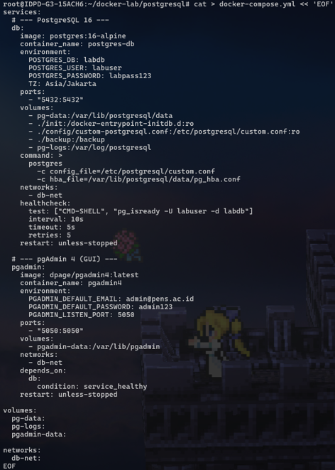
*Gambar 1.3: Screenshot hasil pembuatan file `docker-compose.yml`.*

#### 1.4 Deploy

```bash
docker compose up -d
```

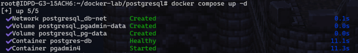
*Gambar 1.4: Screenshot hasil `docker compose up -d` — container berjalan.*

```bash
docker compose ps
```

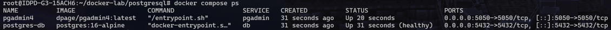
*Gambar 1.5: Screenshot hasil `docker compose ps` menampilkan status container.*

```bash
# Tunggu hingga healthcheck pass
docker compose logs db | tail -20
```

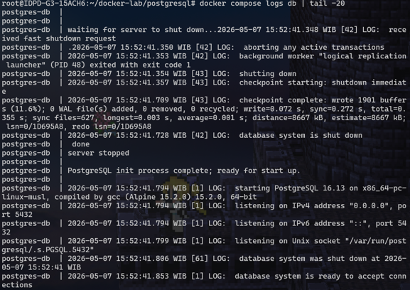
*Gambar 1.6: Screenshot hasil `docker compose logs db | tail -20` — log startup PostgreSQL dan init script.*

---

### Langkah 2: Koneksi dan Verifikasi Database

#### 2.1 Koneksi via psql dari host

```bash
# Install psql client (jika belum)
sudo apt install -y postgresql-client
```

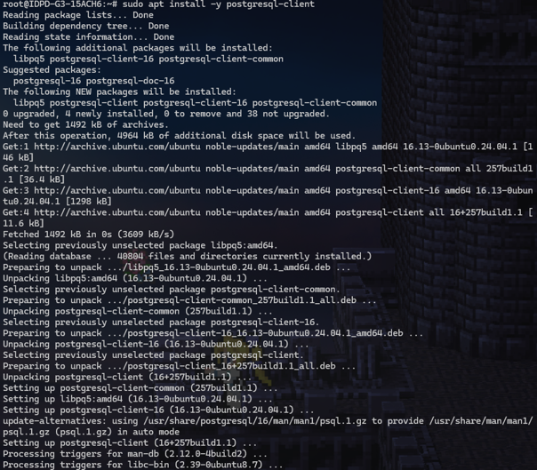
*Gambar 2.1: Screenshot hasil `sudo apt install -y postgresql-client`.*

```bash
# Koneksi ke database
psql -h localhost -U labuser -d labdb
```

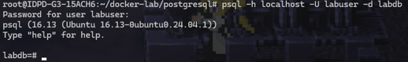
*Gambar 2.2: Screenshot hasil koneksi `psql -h localhost -U labuser -d labdb`.*

```sql
-- Di dalam psql:
\l  -- list databases
```

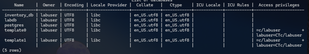
*Gambar 2.3: Screenshot hasil perintah `\l` menampilkan daftar database.*

```sql
\dn  -- list schemas
```

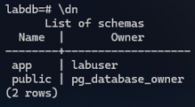
*Gambar 2.4: Screenshot hasil perintah `\dn`.*

```sql
\dt app.*  -- list tabel di schema app
```

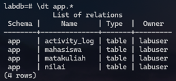
*Gambar 2.5: Screenshot hasil perintah `\dt app.*`.*

```sql
\d+ app.mahasiswa  -- describe tabel mahasiswa
```

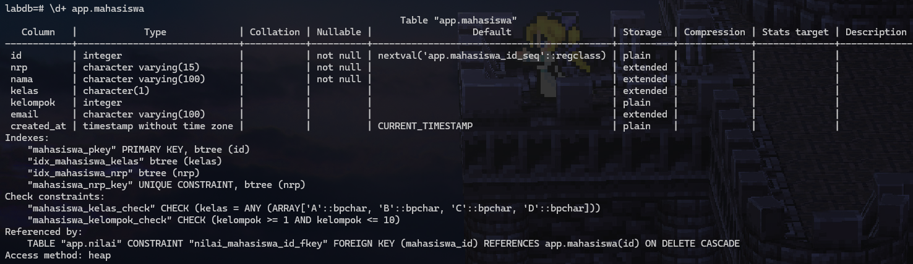
*Gambar 2.6: Screenshot hasil `\d+ app.mahasiswa`.*

```sql
SELECT * FROM app.mahasiswa;
SELECT * FROM app.matakuliah;
\q
```

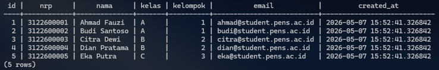
*Gambar 2.7: Screenshot hasil query SELECT data mahasiswa dan matakuliah.*

#### 2.2 Koneksi via docker exec

```bash
# Masuk ke psql di dalam container
docker exec -it postgres-db psql -U labuser -d labdb
```

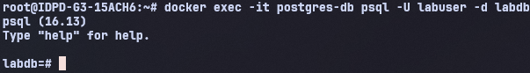
*Gambar 2.8: Screenshot hasil `docker exec -it postgres-db psql -U labuser -d labdb`.*

```sql
-- Query join: Nilai mahasiswa
SELECT m.nrp, m.nama, mk.nama AS matakuliah, n.nilai_angka, n.grade
FROM app.nilai n
JOIN app.mahasiswa m ON n.mahasiswa_id = m.id
JOIN app.matakuliah mk ON n.matakuliah_id = mk.id
ORDER BY m.nrp, mk.nama;

\q
```

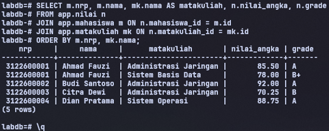
*Gambar 2.9: Screenshot hasil query JOIN menampilkan nilai mahasiswa.*

#### 2.3 Koneksi via pgAdmin4

1. Buka browser: http://localhost:5050
2. Login: `admin@pens.ac.id` / `admin123`
3. **Add New Server:**
   - **Name:** `Lab PostgreSQL`
   - **Host:** `db` (nama service di Docker Compose)
   - **Port:** `5432`
   - **Database:** `labdb`
   - **Username:** `labuser`
   - **Password:** `labpass123`
4. Navigate: **Servers → Lab PostgreSQL → Databases → labdb → Schemas → app → Tables**
5. Klik kanan tabel `mahasiswa` → **View/Edit Data → All Rows**

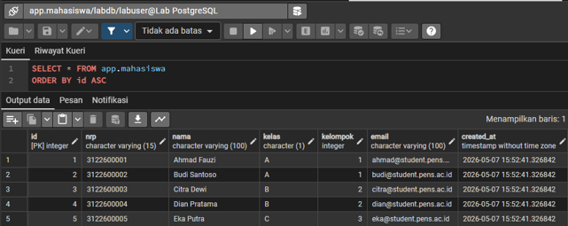
*Gambar 2.10: Screenshot pgAdmin4 — koneksi dan navigasi tabel.*

---

### Langkah 3: Operasi CRUD SQL

```bash
docker exec -it postgres-db psql -U labuser -d labdb << 'SQLEOF'

-- === CREATE ===
INSERT INTO app.mahasiswa (nrp, nama, kelas, kelompok, email)
VALUES ('3122600010', 'Fajar Rizki', 'D', 5, 'fajar@student.pens.ac.id');

-- === READ ===
-- Semua mahasiswa kelas A
SELECT * FROM app.mahasiswa WHERE kelas = 'A';

-- Rata-rata nilai per matakuliah
SELECT mk.nama, AVG(n.nilai_angka)::NUMERIC(5,2) AS rata_rata, COUNT(*) AS jumlah
FROM app.nilai n
JOIN app.matakuliah mk ON n.matakuliah_id = mk.id
GROUP BY mk.nama
ORDER BY rata_rata DESC;

-- === UPDATE ===
UPDATE app.mahasiswa SET email = 'fajar.rizki@student.pens.ac.id'
WHERE nrp = '3122600010';

-- === DELETE ===
DELETE FROM app.mahasiswa WHERE nrp = '3122600010';

-- === JSONB query (untuk tabel activity_log) ===
INSERT INTO app.activity_log (level, source, message, metadata)
VALUES ('INFO', 'web-app', 'User login', '{"user": "admin", "ip": "192.168.1.10"}');

SELECT * FROM app.activity_log
WHERE metadata->>'user' = 'admin';

SQLEOF
```

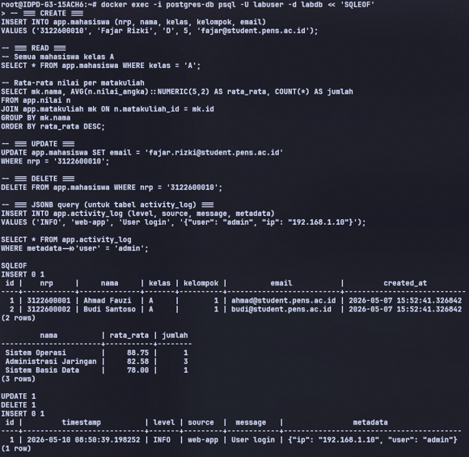
*Gambar 3.1: Screenshot hasil operasi CRUD SQL.*

---

### Langkah 4: Backup dan Restore

#### 4.1 Backup database (pg_dump)

```bash
# Backup dalam format custom (compressed, restorable)
docker exec postgres-db pg_dump -U labuser -d labdb -Fc \
  -f /backup/labdb_backup.dump

# Backup dalam format SQL plain text
docker exec postgres-db pg_dump -U labuser -d labdb \
  -f /backup/labdb_backup.sql

# Backup hanya schema app
docker exec postgres-db pg_dump -U labuser -d labdb -n app -Fc \
  -f /backup/labdb_schema_app.dump

# Verifikasi file backup di host
ls -la backup/
```

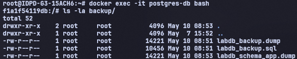
*Gambar 4.1: Screenshot hasil backup database — format custom, SQL, dan schema-only.*

#### 4.2 Restore database

```bash
# Buat database baru untuk restore test
docker exec postgres-db psql -U labuser -d postgres -c "CREATE DATABASE labdb_restore;"
```


*Gambar 4.2: Screenshot hasil `CREATE DATABASE labdb_restore`.*

```bash
# Restore dari custom format
docker exec postgres-db pg_restore -U labuser -d labdb_restore \
  /backup/labdb_backup.dump

# Verifikasi restore
docker exec postgres-db psql -U labuser -d labdb_restore -c "SELECT * FROM app.mahasiswa;"
```

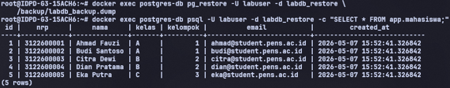
*Gambar 4.3: Screenshot hasil restore dan verifikasi data.*

#### 4.3 Backup otomatis dengan cron di container

```bash
# Buat script backup
cat > backup/auto-backup.sh << 'BASH'
#!/bin/sh
TIMESTAMP=$(date +%Y%m%d_%H%M%S)
BACKUP_FILE="/backup/labdb_${TIMESTAMP}.dump"
pg_dump -U labuser -d labdb -Fc -f "$BACKUP_FILE"
echo "[$(date)] Backup created: $BACKUP_FILE"
# Hapus backup lebih dari 7 hari
find /backup -name "labdb_*.dump" -mtime +7 -delete
BASH
chmod +x backup/auto-backup.sh
```

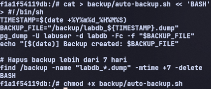
*Gambar 4.4: Screenshot hasil pembuatan `backup/auto-backup.sh`.*

```bash
# Test jalankan manual
docker exec postgres-db /backup/auto-backup.sh
```


*Gambar 4.5: Screenshot hasil menjalankan `auto-backup.sh`.*

```bash
ls -la backup/
```

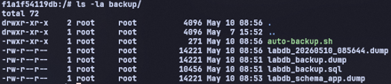
*Gambar 4.6: Screenshot hasil `ls -la backup/` menampilkan file backup.*

---

### Langkah 5: Monitoring PostgreSQL

#### 5.1 Statistik database

```bash
docker exec -it postgres-db psql -U labuser -d labdb << 'SQLEOF'

-- Ukuran database
SELECT pg_database.datname,
       pg_size_pretty(pg_database_size(pg_database.datname)) AS size
FROM pg_database
ORDER BY pg_database_size(pg_database.datname) DESC;

-- Ukuran per tabel
SELECT schemaname || '.' || tablename AS table_full,
       pg_size_pretty(pg_total_relation_size(schemaname || '.' || tablename)) AS total_size
FROM pg_tables
WHERE schemaname = 'app'
ORDER BY pg_total_relation_size(schemaname || '.' || tablename) DESC;

-- Koneksi aktif
SELECT pid, usename, datname, client_addr, state, query_start, query
FROM pg_stat_activity
WHERE datname = 'labdb';

-- Statistik tabel (hits, reads, cache ratio)
SELECT relname,
       seq_scan, seq_tup_read,
       idx_scan, idx_tup_fetch,
       n_tup_ins, n_tup_upd, n_tup_del
FROM pg_stat_user_tables
WHERE schemaname = 'app';

SQLEOF
```

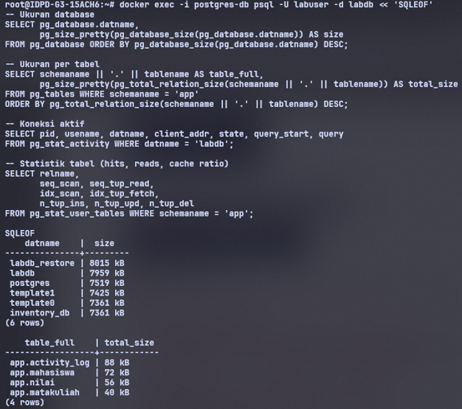
*Gambar 5.1: Screenshot hasil query statistik database — ukuran database dan per tabel.*

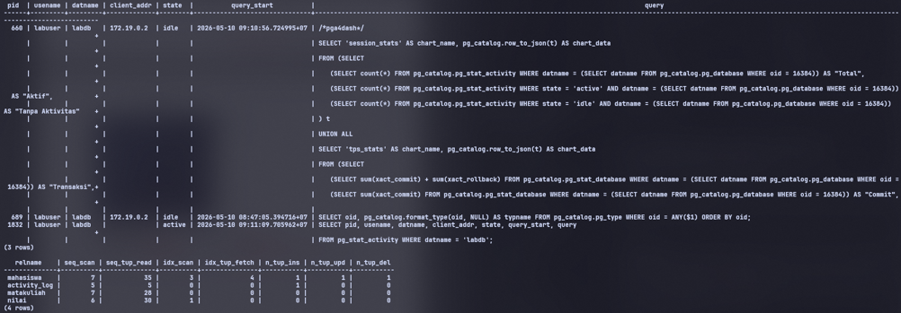
*Gambar 5.2: Screenshot hasil query koneksi aktif dan statistik tabel.*

#### 5.2 Cek PostgreSQL log

```bash
# Lihat log PostgreSQL
docker exec postgres-db ls /var/log/postgresql/
docker exec postgres-db cat /var/log/postgresql/postgresql-$(date +%Y-%m-%d).log | tail -30
```

> **Catatan:** Log PostgreSQL tidak muncul di `/var/log/postgresql` karena image `postgres:16-alpine` pada Docker menggunakan mekanisme logging container (stdout/stderr) alih-alih file logging tradisional. Log dapat dibaca menggunakan `docker logs postgres-db`. Konfigurasi `log_directory='/var/log/postgresql'` tidak berjalan karena direktori log tidak tersedia di container.

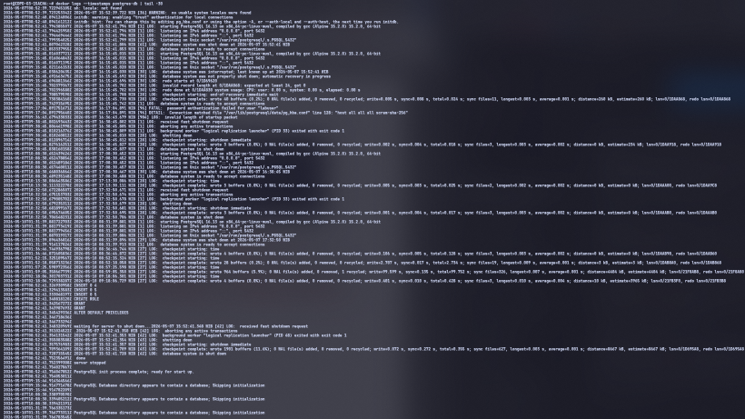
*Gambar 5.3: Screenshot hasil pengecekan log PostgreSQL di container.*

---

## POST LAB

### 1. Jalankan `docker compose down` lalu `docker compose up -d`. Apakah data mahasiswa masih ada? Buktikan.

Data mahasiswa masih ada karena database menggunakan named volume `pg-data`. Saat `docker compose down`, container dihapus tetapi volume tidak ikut dihapus. Setelah `docker compose up -d`, PostgreSQL menggunakan volume yang sama sehingga seluruh tabel dan data tetap persisten. Hal ini dapat dibuktikan dengan query:

```sql
SELECT * FROM app.mahasiswa;
```

yang masih menampilkan data sebelumnya.

### 2. Jalankan `docker compose down -v` lalu `docker compose up -d`. Apa yang terjadi? Apakah init script dijalankan ulang?

Perintah `docker compose down -v` menghapus container sekaligus seluruh volume terkait. Akibatnya seluruh data database hilang. Saat `docker compose up -d` dijalankan kembali, PostgreSQL membuat volume baru sehingga init script pada `/docker-entrypoint-initdb.d/` dijalankan ulang untuk membuat schema, tabel, user, dan sample data dari awal.

### 3. Bandingkan ukuran file backup format custom vs SQL. Mana yang lebih kecil dan mengapa?

Backup format custom (`-Fc`) biasanya lebih kecil dibanding SQL plain text karena menggunakan kompresi internal PostgreSQL. Format SQL menyimpan seluruh query dalam bentuk teks sehingga ukuran file lebih besar terutama untuk database dengan banyak data.

### 4. Buat query yang menampilkan mahasiswa yang belum memiliki nilai di semester apapun.

```sql
SELECT m.*
FROM app.mahasiswa m
LEFT JOIN app.nilai n
    ON m.id = n.mahasiswa_id
WHERE n.id IS NULL;
```

Query tersebut menggunakan `LEFT JOIN` untuk mencari mahasiswa yang tidak memiliki pasangan data pada tabel nilai.

### 5. Jelaskan peran user `app_reader` yang dibuat di init script. Apa bedanya dengan `labuser`?

- `app_reader` merupakan user read-only yang hanya memiliki hak `SELECT` pada tabel schema `app`. User ini digunakan untuk aplikasi atau monitoring yang hanya perlu membaca data tanpa melakukan perubahan.
- `labuser` adalah user utama database yang memiliki hak lebih tinggi untuk melakukan operasi seperti `INSERT`, `UPDATE`, `DELETE`, `CREATE TABLE`, dan administrasi database lainnya.
- Pemisahan role ini meningkatkan keamanan karena prinsip least privilege dapat diterapkan.

---

*Laporan ini dibuat sebagai bagian dari praktikum Workshop Administrasi Jaringan, Program Studi D4 Teknik Informatika, Politeknik Elektronika Negeri Surabaya (PENS), 2026.*
