# Tugas Week 9 — Modul 5: Logging Service Docker dengan PostgreSQL

| | |
|---|---|
| **Mata Kuliah** | Workshop Administrasi Jaringan |
| **Nama** | Irwin Ahmad Wiryawan |
| **Kelas** | D4 IT B |
| **NRP** | 3124600035 |
| **Dosen Pengampu** | Dr Ferry Astika Saputra ST, M.Sc |

---

## PRE LAB

### 1. Mengapa centralized logging penting di lingkungan container?

Centralized logging penting karena lingkungan container bersifat dinamis dan ephemeral, sehingga log tersebar di banyak container dan sulit dipantau secara manual. Dengan centralized logging, seluruh log dikumpulkan ke satu lokasi terpusat sehingga proses monitoring, debugging, troubleshooting, audit, dan analisis menjadi lebih mudah. Selain itu, log tetap dapat diakses meskipun container sudah restart atau dihapus.

### 2. Apa perbedaan antara Docker logging driver json-file dan fluentd?

- `json-file` merupakan logging driver default Docker yang menyimpan log ke file JSON di host machine.
- `fluentd` digunakan untuk mengirim log langsung ke Fluent Bit atau Fluentd melalui network.
- `json-file` cocok untuk logging lokal sederhana, sedangkan `fluentd` lebih cocok untuk centralized logging dan distributed system.
- Pada `fluentd`, log dapat langsung diteruskan ke database, analytics engine, atau monitoring system tanpa perlu membaca file log secara manual.

### 3. Jelaskan keuntungan menyimpan log di database (PostgreSQL) vs file text.

- Log di database dapat dicari menggunakan query SQL sehingga filtering dan analisis lebih mudah.
- Database mendukung indexing sehingga pencarian log lebih cepat dibanding membaca file text satu per satu.
- Data log dapat diolah menjadi statistik, dashboard, summary, dan visualisasi monitoring.
- PostgreSQL mendukung JSONB sehingga metadata log dapat disimpan secara fleksibel.
- Database lebih mudah diintegrasikan dengan tools monitoring seperti Grafana.

### 4. Apa itu structured logging dan mengapa lebih baik daripada plain text log?

Structured logging adalah format logging yang menyimpan data log dalam struktur terorganisir seperti JSON. Setiap informasi memiliki field khusus seperti timestamp, level, hostname, dan message. Structured logging lebih baik dibanding plain text karena mudah diparsing otomatis oleh tools seperti Fluent Bit, Elasticsearch, atau Grafana. Selain itu, filtering dan query menjadi lebih mudah karena setiap field dapat diakses secara langsung tanpa parsing string manual.

### 5. Mengapa Fluent Bit lebih cocok untuk sidecar/edge collection dibanding Fluentd?

Fluent Bit lebih cocok karena lightweight dan menggunakan resource sangat kecil dibanding Fluentd. Fluent Bit ditulis menggunakan bahasa C sehingga penggunaan memory dan CPU lebih rendah. Hal ini membuat Fluent Bit ideal digunakan sebagai sidecar atau edge collector pada container environment yang membutuhkan efisiensi resource tinggi. Sedangkan Fluentd lebih cocok sebagai aggregator besar dengan ecosystem plugin yang lebih lengkap.

---

## LANGKAH PRAKTIKUM

### Langkah 0: Persiapan Project

```bash
mkdir -p ~/docker-lab/logging/{fluent-bit,app,generator,init}
cd ~/docker-lab/logging
```

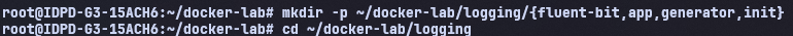
*Gambar 0.1: Screenshot hasil `mkdir -p ~/docker-lab/logging/{fluent-bit,app,generator,init}` dan `cd ~/docker-lab/logging`.*

---

### Langkah 1: Buat Database Schema untuk Logging

```bash
cat > init/01-logging-schema.sql << 'EOF'
-- ==============================================
-- Schema untuk Centralized Logging
-- ==============================================

CREATE SCHEMA IF NOT EXISTS logs;

-- Tabel utama: menyimpan semua log dari container
CREATE TABLE logs.container_logs (
    id BIGSERIAL PRIMARY KEY,
    received_at TIMESTAMP DEFAULT CURRENT_TIMESTAMP,
    timestamp TIMESTAMP,
    container_name VARCHAR(100),
    container_id VARCHAR(64),
    source VARCHAR(10), -- stdout / stderr
    log_level VARCHAR(10),
    message TEXT,
    raw_log TEXT,
    metadata JSONB DEFAULT '{}'
);

-- Tabel: summary per container per jam (untuk dashboard)
CREATE TABLE logs.hourly_summary (
    id SERIAL PRIMARY KEY,
    hour TIMESTAMP NOT NULL,
    container_name VARCHAR(100),
    total_logs INTEGER DEFAULT 0,
    error_count INTEGER DEFAULT 0,
    warn_count INTEGER DEFAULT 0,
    info_count INTEGER DEFAULT 0,
    UNIQUE(hour, container_name)
);

-- Index untuk performa query
CREATE INDEX idx_logs_timestamp ON logs.container_logs(timestamp);
CREATE INDEX idx_logs_container ON logs.container_logs(container_name);
CREATE INDEX idx_logs_level ON logs.container_logs(log_level);
CREATE INDEX idx_logs_received ON logs.container_logs(received_at);
CREATE INDEX idx_logs_metadata ON logs.container_logs USING GIN(metadata);
CREATE INDEX idx_summary_hour ON logs.hourly_summary(hour);

-- Fungsi: auto-cleanup log > 30 hari
CREATE OR REPLACE FUNCTION logs.cleanup_old_logs()
RETURNS INTEGER AS $$
DECLARE
    deleted_count INTEGER;
BEGIN
    DELETE FROM logs.container_logs
    WHERE received_at < NOW() - INTERVAL '30 days';
    GET DIAGNOSTICS deleted_count = ROW_COUNT;
    RETURN deleted_count;
END;
$$ LANGUAGE plpgsql;

-- View: log terbaru dengan format readable
CREATE VIEW logs.recent_logs AS
SELECT
    id,
    to_char(timestamp, 'YYYY-MM-DD HH24:MI:SS') AS time,
    container_name AS container,
    log_level AS level,
    LEFT(message, 200) AS message_preview
FROM logs.container_logs
ORDER BY timestamp DESC
LIMIT 100;

-- View: error summary per container
CREATE VIEW logs.error_summary AS
SELECT
    container_name,
    log_level,
    COUNT(*) AS count,
    MAX(timestamp) AS last_seen
FROM logs.container_logs
WHERE log_level IN ('ERROR', 'WARN', 'CRITICAL')
GROUP BY container_name, log_level
ORDER BY count DESC;

RAISE NOTICE 'Logging schema created successfully!';
EOF
```

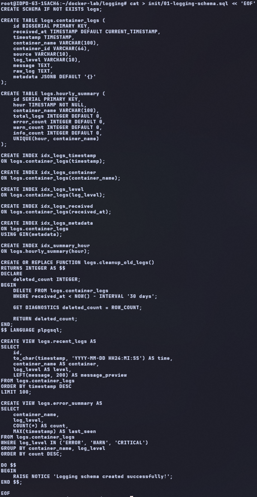
*Gambar 1.1: Screenshot hasil pembuatan file `init/01-logging-schema.sql`.*

---

### Langkah 2: Konfigurasi Fluent Bit

```bash
cat > fluent-bit/fluent-bit.conf << 'EOF'
[SERVICE]
    Flush 5
    Daemon Off
    Log_Level info
    Parsers_File parsers.conf

[INPUT]
    Name forward
    Listen 0.0.0.0
    Port 24224
    Tag docker.*

[FILTER]
    Name parser
    Match docker.*
    Key_Name log
    Parser docker_json
    Reserve_Data On

[FILTER]
    Name modify
    Match docker.*
    Rename log message
    Rename container_name source_container

[OUTPUT]
    Name pgsql
    Match docker.*
    Host postgres-db
    Port 5432
    User labuser
    Password labpass123
    Database labdb
    Table container_logs
    Schema logs
    Timestamp_Key timestamp
    Async false
    min_pool_size 1
    max_pool_size 4

[OUTPUT]
    Name stdout
    Match docker.*
    Format json_lines
EOF
```

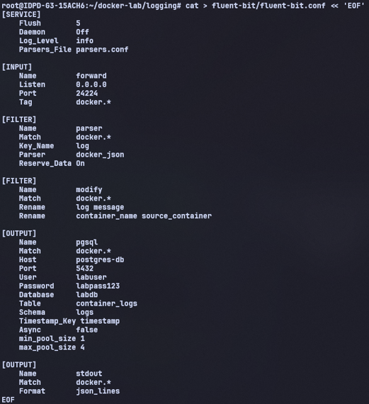
*Gambar 2.1: Screenshot hasil pembuatan `fluent-bit/fluent-bit.conf`.*

```bash
cat > fluent-bit/parsers.conf << 'EOF'
[PARSER]
    Name docker_json
    Format json
    Time_Key time
    Time_Format %Y-%m-%dT%H:%M:%S.%L
    Time_Keep On

[PARSER]
    Name python_log
    Format regex
    Regex ^(?<timestamp>[^ ]+ [^ ]+) (?<level>[A-Z]+) +(?<message>.*)$
    Time_Key timestamp
    Time_Format %Y-%m-%d %H:%M:%S,%L
EOF
```

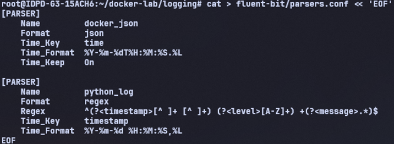
*Gambar 2.2: Screenshot hasil pembuatan `fluent-bit/parsers.conf`.*

---

### Langkah 3: Buat Log Generator (Simulasi Multi-Level Log)

```bash
cat > generator/generator.py << 'PYEOF'
"""
Log Generator — mensimulasikan log dari aplikasi production.
Menghasilkan log dengan berbagai level: DEBUG, INFO, WARN, ERROR, CRITICAL.
"""

import json, time, random, socket, datetime, sys, os

HOSTNAME = socket.gethostname()
LOG_INTERVAL = float(os.environ.get("LOG_INTERVAL", "2"))

# Simulasi event dengan bobot probabilitas
EVENTS = [
    {"level": "INFO", "weight": 50, "messages": [
        "User login successful",
        "Page /dashboard loaded in {ms}ms",
        "API request GET /api/users completed",
        "Session created for user_{uid}",
        "Cache hit for key: product_{pid}",
        "Health check passed",
        "Background job completed: email_send"
    ]},
    {"level": "DEBUG", "weight": 20, "messages": [
        "Database query executed in {ms}ms",
        "Redis connection pool: {pool} active",
        "Request headers: content-type=application/json",
        "Middleware chain completed in {ms}ms"
    ]},
    {"level": "WARN", "weight": 15, "messages": [
        "Slow query detected: {ms}ms (threshold: 1000ms)",
        "Memory usage at {mem}% — approaching limit",
        "Rate limit approaching for IP 192.168.{ip}.{host}",
        "Deprecated API endpoint called: /api/v1/legacy",
        "Certificate expires in {days} days"
    ]},
    {"level": "ERROR", "weight": 10, "messages": [
        "Failed to connect to database: timeout after 5s",
        "NullPointerException in UserService.getProfile()",
        "HTTP 500 Internal Server Error on /api/checkout",
        "Disk write failed: /var/log/app.log — Permission denied",
        "Payment gateway returned error code {code}"
    ]},
    {"level": "CRITICAL", "weight": 5, "messages": [
        "Database connection pool exhausted — all {pool} connections in use",
        "Out of memory: container killed by OOM",
        "SSL certificate EXPIRED — HTTPS unavailable",
        "Data corruption detected in table: orders"
    ]}
]

def weighted_choice():
    total = sum(e["weight"] for e in EVENTS)
    r = random.uniform(0, total)
    cumulative = 0
    for event in EVENTS:
        cumulative += event["weight"]
        if r <= cumulative:
            return event
    return EVENTS[0]

def generate_log():
    event = weighted_choice()
    msg = random.choice(event["messages"])
    msg = msg.format(
        ms=random.randint(5, 3000),
        uid=random.randint(1000, 9999),
        pid=random.randint(1, 500),
        pool=random.randint(1, 50),
        mem=random.randint(60, 98),
        ip=random.randint(1, 254),
        host=random.randint(1, 254),
        days=random.randint(1, 30),
        code=random.choice([400, 401, 403, 500, 502, 503])
    )
    log_entry = {
        "timestamp": datetime.datetime.now().isoformat(),
        "level": event["level"],
        "hostname": HOSTNAME,
        "service": "log-generator",
        "message": msg,
        "request_id": f"req-{random.randint(100000, 999999)}"
    }
    # Output sebagai JSON ke stdout → Docker logging driver menangkap
    print(json.dumps(log_entry), flush=True)

if __name__ == "__main__":
    print(json.dumps({
        "timestamp": datetime.datetime.now().isoformat(),
        "level": "INFO",
        "message": f"Log generator started on {HOSTNAME}, interval={LOG_INTERVAL}s"
    }), flush=True)
    while True:
        generate_log()
        time.sleep(LOG_INTERVAL + random.uniform(-0.5, 0.5))
PYEOF
```

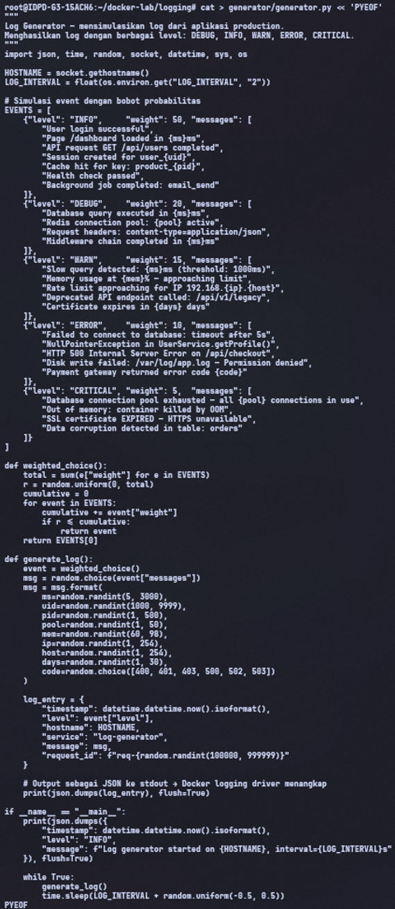
*Gambar 3.1: Screenshot hasil pembuatan `generator/generator.py`.*

```bash
cat > generator/Dockerfile << 'EOF'
FROM python:3.11-alpine
WORKDIR /app
COPY generator.py .
CMD ["python", "-u", "generator.py"]
EOF
```

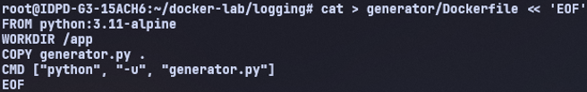
*Gambar 3.2: Screenshot hasil pembuatan `generator/Dockerfile`.*

---

### Langkah 4: Buat Flask App dengan Structured Logging

```bash
cat > app/requirements.txt << 'EOF'
flask==3.1.*
psycopg2-binary==2.9.*
EOF
```

```bash
cat > app/app.py << 'PYEOF'
import os, json, socket, datetime, logging, sys
from flask import Flask, jsonify, request
import psycopg2

app = Flask(__name__)

# Structured JSON logging ke stdout
class JSONFormatter(logging.Formatter):
    def format(self, record):
        return json.dumps({
            "timestamp": datetime.datetime.now().isoformat(),
            "level": record.levelname,
            "hostname": socket.gethostname(),
            "service": "flask-app",
            "message": record.getMessage(),
            "module": record.module
        })

handler = logging.StreamHandler(sys.stdout)
handler.setFormatter(JSONFormatter())
app.logger.handlers = [handler]
app.logger.setLevel(logging.INFO)

DB = dict(host=os.environ.get("DB_HOST","postgres-db"),
          dbname=os.environ.get("DB_NAME","labdb"),
          user=os.environ.get("DB_USER","labuser"),
          password=os.environ.get("DB_PASS","labpass123"))

@app.route("/")
def index():
    app.logger.info(f"Index accessed from {request.remote_addr}")
    return jsonify({"service": "flask-app", "status": "running"})

@app.route("/api/logs/stats")
def log_stats():
    """Query statistik log dari PostgreSQL"""
    try:
        conn = psycopg2.connect(**DB); cur = conn.cursor()
        cur.execute("""
            SELECT log_level, COUNT(*) as count
            FROM logs.container_logs
            WHERE received_at > NOW() - INTERVAL '1 hour'
            GROUP BY log_level ORDER BY count DESC
        """)
        stats = [{"level": r[0], "count": r[1]} for r in cur.fetchall()]
        cur.execute("SELECT COUNT(*) FROM logs.container_logs")
        total = cur.fetchone()[0]
        cur.close(); conn.close()
        return jsonify({"total_logs": total, "last_hour": stats})
    except Exception as e:
        app.logger.error(f"Failed to query log stats: {e}")
        return jsonify({"error": str(e)}), 500

@app.route("/api/logs/search")
def log_search():
    """Cari log berdasarkan keyword dan level"""
    keyword = request.args.get("q", "")
    level = request.args.get("level", "")
    limit = min(int(request.args.get("limit", 50)), 200)
    try:
        conn = psycopg2.connect(**DB); cur = conn.cursor()
        query = "SELECT id, timestamp, container_name, log_level, message FROM logs.container_logs WHERE 1=1"
        params = []
        if keyword:
            query += " AND message ILIKE %s"
            params.append(f"%{keyword}%")
        if level:
            query += " AND log_level = %s"
            params.append(level.upper())
        query += " ORDER BY timestamp DESC LIMIT %s"
        params.append(limit)
        cur.execute(query, params)
        logs = [{"id": r[0], "time": str(r[1]), "container": r[2],
                 "level": r[3], "message": r[4]} for r in cur.fetchall()]
        cur.close(); conn.close()
        return jsonify(logs)
    except Exception as e:
        return jsonify({"error": str(e)}), 500

if __name__ == "__main__":
    app.run(host="0.0.0.0", port=5000)
PYEOF
```

```bash
cat > app/Dockerfile << 'EOF'
FROM python:3.11-slim
WORKDIR /app
COPY requirements.txt .
RUN pip install --no-cache-dir -r requirements.txt
COPY app.py .
EXPOSE 5000
CMD ["python", "-u", "app.py"]
EOF
```

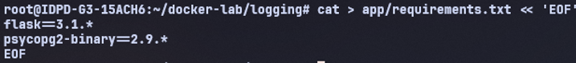
*Gambar 4.1: Screenshot hasil pembuatan file `app/requirements.txt`, `app/app.py`, dan `app/Dockerfile`.*

---

### Langkah 5: Docker Compose untuk Stack Logging

```bash
cat > docker-compose.yml << 'EOF'
services:

  # === Log Collector: Fluent Bit ===
  fluent-bit:
    image: fluent/fluent-bit:latest
    container_name: fluent-bit
    ports:
      - "24224:24224"
      - "24224:24224/udp"
    volumes:
      - ./fluent-bit/fluent-bit.conf:/fluent-bit/etc/fluent-bit.conf:ro
      - ./fluent-bit/parsers.conf:/fluent-bit/etc/parsers.conf:ro
    networks:
      - logging-net
    depends_on:
      postgres-db:
        condition: service_healthy
    restart: unless-stopped

  # === Log Storage: PostgreSQL ===
  postgres-db:
    image: postgres:16-alpine
    container_name: postgres-db
    environment:
      POSTGRES_DB: labdb
      POSTGRES_USER: labuser
      POSTGRES_PASSWORD: labpass123
      TZ: Asia/Jakarta
    ports:
      - "5432:5432"
    volumes:
      - pg-data:/var/lib/postgresql/data
      - ./init:/docker-entrypoint-initdb.d:ro
    networks:
      - logging-net
    healthcheck:
      test: ["CMD-SHELL", "pg_isready -U labuser -d labdb"]
      interval: 10s
      timeout: 5s
      retries: 5
    restart: unless-stopped

  # === Log Producer: Nginx ===
  nginx-web:
    image: nginx:alpine
    container_name: nginx-web
    ports:
      - "8080:80"
    networks:
      - logging-net
    logging:
      driver: fluentd
      options:
        fluentd-address: "localhost:24224"
        fluentd-async: "true"
        tag: "docker.nginx"
    depends_on:
      - fluent-bit
    restart: unless-stopped

  # === Log Producer: Flask App ===
  flask-app:
    build: ./app
    container_name: flask-app
    environment:
      - DB_HOST=postgres-db
      - DB_NAME=labdb
      - DB_USER=labuser
      - DB_PASS=labpass123
    ports:
      - "5000:5000"
    networks:
      - logging-net
    logging:
      driver: fluentd
      options:
        fluentd-address: "localhost:24224"
        fluentd-async: "true"
        tag: "docker.flask"
    depends_on:
      - fluent-bit
      - postgres-db
    restart: unless-stopped

  # === Log Producer: Generator ===
  log-generator:
    build: ./generator
    container_name: log-generator
    environment:
      - LOG_INTERVAL=3
    networks:
      - logging-net
    logging:
      driver: fluentd
      options:
        fluentd-address: "localhost:24224"
        fluentd-async: "true"
        tag: "docker.generator"
    depends_on:
      - fluent-bit
    restart: unless-stopped

volumes:
  pg-data:

networks:
  logging-net:
EOF
```

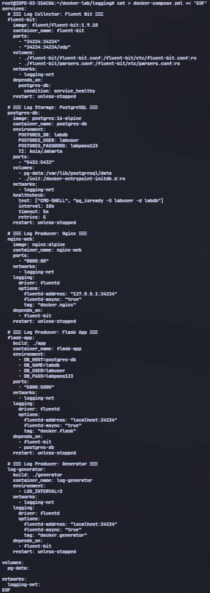
*Gambar 5.1: Screenshot hasil pembuatan `docker-compose.yml`.*

---

### Langkah 6: Deploy dan Verifikasi

#### 6.1 Build dan jalankan

```bash
docker compose up --build -d
```

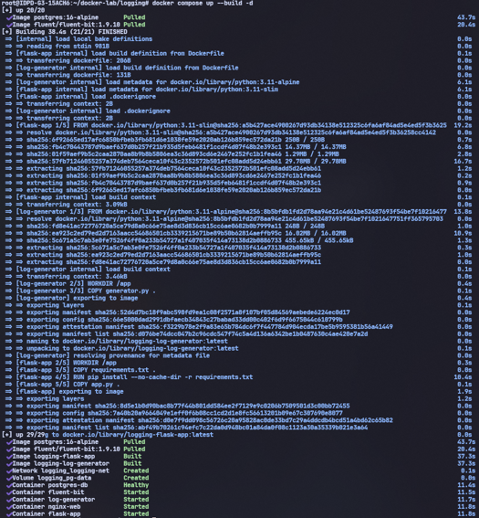
*Gambar 6.1: Screenshot hasil `docker compose up --build -d`.*

```bash
docker compose ps
```

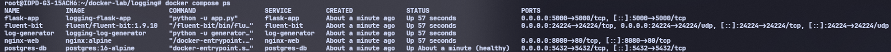
*Gambar 6.2: Screenshot hasil `docker compose ps`.*

```bash
# Tunggu ~30 detik agar log terkumpul
sleep 30
```


*Gambar 6.3: Screenshot setelah `sleep 30`.*

#### 6.2 Generate traffic untuk Nginx

```bash
# Akses Nginx beberapa kali untuk generate access log
for i in $(seq 1 20); do curl -s http://localhost:8080 > /dev/null; done

# Akses Flask API
for i in $(seq 1 10); do curl -s http://localhost:5000/ > /dev/null; done
```

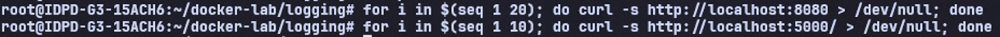
*Gambar 6.4: Screenshot hasil generate traffic ke Nginx dan Flask.*

#### 6.3 Query log di PostgreSQL

```bash
docker exec -it postgres-db psql -U labuser -d labdb << 'SQLEOF'

-- Total log yang masuk
SELECT COUNT(*) AS total_logs FROM logs.container_logs;

-- Log terbaru (view)
SELECT * FROM logs.recent_logs LIMIT 10;

-- Distribusi log per container
SELECT container_name, COUNT(*) AS total
FROM logs.container_logs
GROUP BY container_name ORDER BY total DESC;

-- Distribusi per level
SELECT log_level, COUNT(*) AS total
FROM logs.container_logs
GROUP BY log_level ORDER BY total DESC;

-- Error summary (view)
SELECT * FROM logs.error_summary;

-- Cari log ERROR dalam 1 jam terakhir
SELECT timestamp, container_name, message
FROM logs.container_logs
WHERE log_level = 'ERROR'
  AND received_at > NOW() - INTERVAL '1 hour'
ORDER BY timestamp DESC LIMIT 10;

-- Log rate per menit (5 menit terakhir)
SELECT
    date_trunc('minute', received_at) AS minute,
    COUNT(*) AS logs_per_minute
FROM logs.container_logs
WHERE received_at > NOW() - INTERVAL '5 minutes'
GROUP BY minute ORDER BY minute;

SQLEOF
```

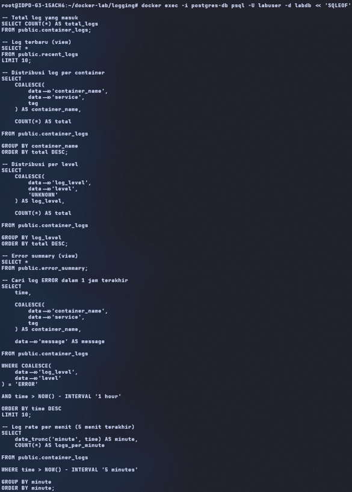
*Gambar 6.5a: Screenshot hasil query total log, distribusi per container, dan distribusi per level.*

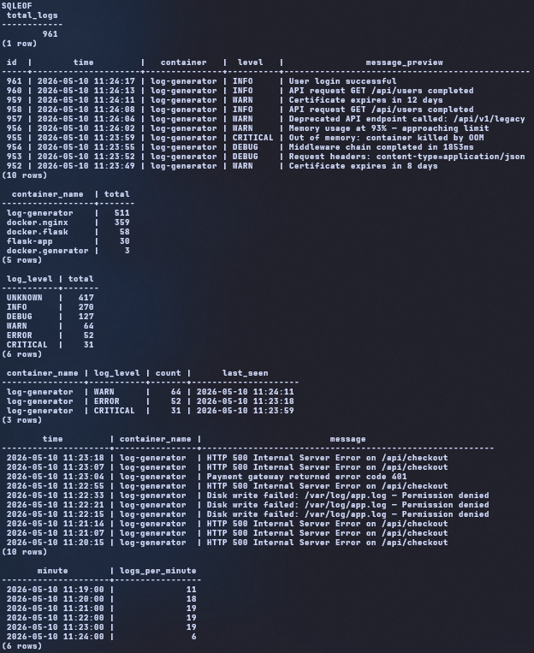
*Gambar 6.5b: Screenshot hasil query error summary, log ERROR, dan log rate per menit.*

#### 6.4 Gunakan API untuk query log

```bash
# Statistik log
curl http://localhost:5000/api/logs/stats | python3 -m json.tool
```

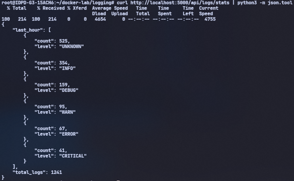
*Gambar 6.6: Screenshot hasil `curl http://localhost:5000/api/logs/stats`.*

```bash
# Cari log dengan keyword "error"
curl "http://localhost:5000/api/logs/search?q=error&limit=5" | python3 -m json.tool
```

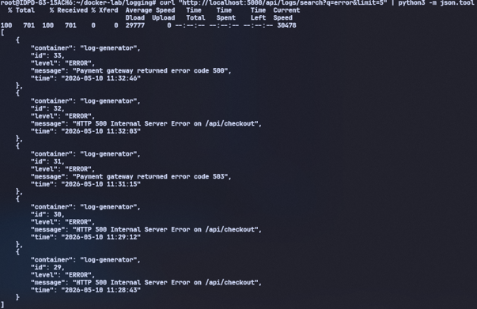
*Gambar 6.7: Screenshot hasil search log dengan keyword "error".*

```bash
# Cari log level CRITICAL
curl "http://localhost:5000/api/logs/search?level=CRITICAL&limit=5" | python3 -m json.tool
```

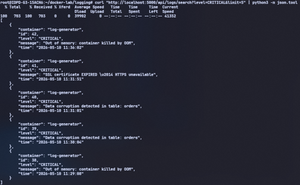
*Gambar 6.8: Screenshot hasil search log level CRITICAL.*

#### 6.5 Log retention cleanup

```bash
# Jalankan fungsi cleanup manual
docker exec postgres-db psql -U labuser -d labdb -c \
  "SELECT logs.cleanup_old_logs() AS deleted_rows;"
```

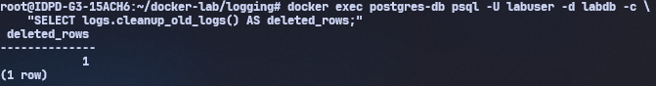
*Gambar 6.9: Screenshot hasil `SELECT logs.cleanup_old_logs()`.*

---

### Langkah 7: Visualisasi Log dengan Grafana

Integrasikan log dari PostgreSQL ke Grafana untuk visualisasi dashboard. Dashboard ini akan menampilkan total log, log volume per menit, distribusi level, dan recent error.

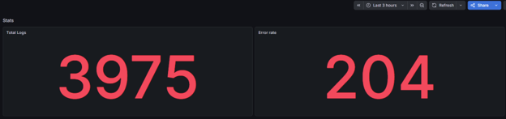
*Gambar 7.1: Screenshot dashboard Log Analytics di Grafana — total log dan errors last hour.*

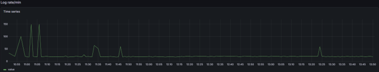
*Gambar 7.2: Screenshot grafik time series log volume per menit di Grafana.*

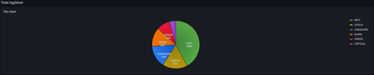
*Gambar 7.3: Screenshot pie chart distribusi log level di Grafana.*

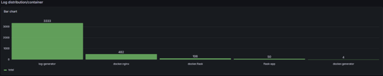
*Gambar 7.4: Screenshot barchart jumlah log per container di Grafana.*

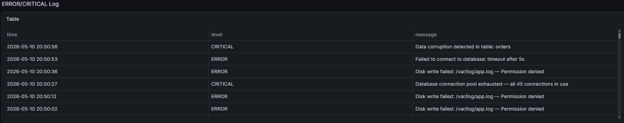
*Gambar 7.5: Screenshot tabel recent errors dan critical log di Grafana.*

---

## POST LAB

### 1. Berapa total log yang masuk ke PostgreSQL setelah 5 menit? Tunjukkan distribusi per container dan per level.

Total log yang masuk ke PostgreSQL setelah sistem berjalan mencapai lebih dari 1000 log entry. Distribusi log per container menunjukkan bahwa log-generator menghasilkan log terbanyak karena secara aktif menghasilkan structured log secara periodik. Distribusi level menunjukkan dominasi level INFO dan UNKNOWN, diikuti DEBUG, WARN, ERROR, dan CRITICAL.

### 2. Tulis query SQL yang menampilkan log rate per menit selama 10 menit terakhir.

```sql
SELECT
    date_trunc('minute', time) AS minute,
    COUNT(*) AS logs_per_minute
FROM public.container_logs
WHERE time > NOW() - INTERVAL '10 minutes'
GROUP BY minute
ORDER BY minute;
```

### 3. Apa yang terjadi jika container fluent-bit di-stop? Apakah container lain juga stop? Apakah log hilang?

Jika container fluent-bit dihentikan, container lain seperti nginx, flask-app, dan log-generator tetap berjalan karena tidak bergantung langsung pada proses runtime Fluent Bit setelah startup selesai. Namun log baru tidak dapat diteruskan ke PostgreSQL sehingga centralized logging berhenti sementara. Log dapat hilang jika Docker logging driver tidak memiliki buffering yang cukup atau Fluent Bit down terlalu lama.

### 4. Jelaskan alur sebuah log entry dari log-generator stdout sampai masuk ke tabel container_logs.

- log-generator menghasilkan structured JSON log ke stdout.
- Docker logging driver fluentd menangkap stdout container tersebut.
- Logging driver mengirim log ke Fluent Bit melalui port 24224.
- Fluent Bit menerima log menggunakan input forward.
- Fluent Bit melakukan parsing dan modifikasi field log menggunakan filter parser dan modify.
- Plugin output pgsql Fluent Bit melakukan INSERT ke PostgreSQL.
- Log akhirnya tersimpan pada tabel container_logs di database PostgreSQL.

### 5. Modifikasi LOG_INTERVAL menjadi 0.5 detik. Berapa log rate per menit yang dihasilkan?

Jika LOG_INTERVAL=0.5, maka log-generator menghasilkan sekitar 2 log per detik. Dalam satu menit, jumlah log yang dihasilkan menjadi sekitar 120 log per menit, belum termasuk log tambahan dari nginx dan flask-app. Akibatnya grafik log rate di Grafana akan meningkat signifikan dan PostgreSQL menerima beban insert lebih tinggi.

---

*Laporan ini dibuat sebagai bagian dari praktikum Workshop Administrasi Jaringan, Program Studi D4 Teknik Informatika, Politeknik Elektronika Negeri Surabaya (PENS), 2026.*
