# Tugas Week 10 — Modul 6: Grafana Service Docker untuk Monitoring Resource

| | |
|---|---|
| **Mata Kuliah** | Workshop Administrasi Jaringan |
| **Nama** | Irwin Ahmad Wiryawan |
| **Kelas** | D4 IT B |
| **NRP** | 3124600035 |
| **Dosen Pengampu** | Dr Ferry Astika Saputra ST, M.Sc |

---

## PRE LAB

### 1. Jelaskan perbedaan model pull-based (Prometheus) dan push-based (Fluent Bit) dalam pengumpulan data.

- Pull-based: server mengambil data sendiri dari target (Prometheus scrape /metrics).
- Push-based: client langsung mengirim data (Fluent Bit push logs ke PostgreSQL).

### 2. Apa itu PromQL? Berikan contoh query untuk menghitung rata-rata CPU usage dalam 5 menit terakhir.

PromQL adalah bahasa query untuk metrics di Prometheus.

Contoh rata-rata CPU usage 5 menit terakhir:
```
100 - (avg(rate(node_cpu_seconds_total{mode="idle"}[5m])) * 100)
```

### 3. Mengapa cAdvisor membutuhkan akses ke /var/run/docker.sock dan /sys?

- `/var/run/docker.sock`: membaca informasi container Docker.
- `/sys`: membaca statistik kernel seperti CPU, memory, dan cgroup.

### 4. Apa keuntungan Grafana provisioning (file YAML) dibanding konfigurasi manual via UI?

- otomatis saat startup
- bisa disimpan di Git
- konsisten antar server
- tidak perlu setup manual via UI

### 5. Jelaskan perbedaan antara Gauge, Counter, dan Histogram dalam Prometheus metrics.

| Type      | Karakteristik     | Contoh          |
|-----------|-------------------|-----------------|
| Gauge     | bisa naik/turun   | RAM usage       |
| Counter   | hanya naik        | total requests  |
| Histogram | distribusi data   | request latency |

---

## LANGKAH PRAKTIKUM

### Langkah 0: Persiapan Project

```bash
mkdir -p ~/docker-lab/monitoring/{prometheus,grafana/{provisioning/datasources,provisioning/dashboards,dashboards},app,generator,fluent-bit,init}
cd ~/docker-lab/monitoring
```

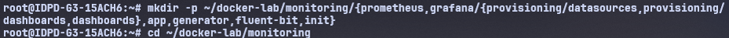
*Gambar 0.1: Screenshot hasil `mkdir -p` membuat struktur direktori project monitoring.*

---

### Langkah 1: Konfigurasi Prometheus

#### 1.1 Buat konfigurasi scrape

```bash
cat > prometheus/prometheus.yml << 'EOF'
# ==============================================
# Prometheus Configuration
# ==============================================

global:
  scrape_interval: 15s      # Scrape setiap 15 detik
  evaluation_interval: 15s  # Evaluasi rules setiap 15 detik
  scrape_timeout: 10s

# ==============================================
# Alerting Rules
# ==============================================
rule_files:
  - "alert_rules.yml"

# ==============================================
# Scrape Targets
# ==============================================
scrape_configs:
  # --- Prometheus self-monitoring ---
  - job_name: "prometheus"
    static_configs:
      - targets: ["localhost:9090"]
    labels:
      instance: "prometheus-server"

  # --- Node Exporter (host metrics) ---
  - job_name: "node-exporter"
    static_configs:
      - targets: ["node-exporter:9100"]
    labels:
      instance: "docker-host"

  # --- cAdvisor (container metrics) ---
  - job_name: "cadvisor"
    static_configs:
      - targets: ["cadvisor:8080"]
    labels:
      instance: "docker-containers"

  # --- Flask Application ---
  - job_name: "flask-app"
    metrics_path: "/metrics"
    static_configs:
      - targets: ["flask-app:5000"]
    labels:
      instance: "flask-backend"
EOF
```

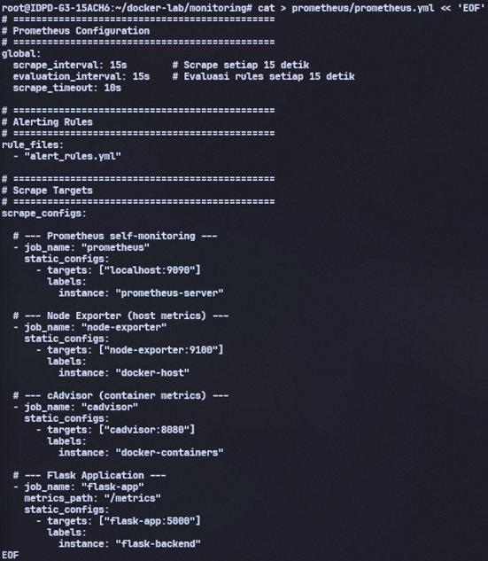
*Gambar 1.1: Screenshot hasil pembuatan `prometheus/prometheus.yml`.*

#### 1.2 Buat alert rules

```bash
cat > prometheus/alert_rules.yml << 'EOF'
groups:
  - name: host_alerts
    rules:
      # CPU usage > 80% selama 2 menit
      - alert: HighCpuUsage
        expr: 100 - (avg(rate(node_cpu_seconds_total{mode="idle"}[5m])) * 100) > 80
        for: 2m
        labels:
          severity: warning
        annotations:
          summary: "CPU usage tinggi ({{ $value | printf \"%.1f\" }}%)"
          description: "CPU usage di atas 80% selama lebih dari 2 menit."

      # Memory available < 20%
      - alert: LowMemoryAvailable
        expr: (node_memory_MemAvailable_bytes / node_memory_MemTotal_bytes * 100) < 20
        for: 2m
        labels:
          severity: warning
        annotations:
          summary: "Memory tersedia rendah ({{ $value | printf \"%.1f\" }}%)"

      # Disk usage > 85%
      - alert: HighDiskUsage
        expr: 100 - (node_filesystem_avail_bytes{mountpoint="/"} / node_filesystem_size_bytes{mountpoint="/"} * 100) > 85
        for: 5m
        labels:
          severity: critical
        annotations:
          summary: "Disk usage tinggi ({{ $value | printf \"%.1f\" }}%)"

  - name: container_alerts
    rules:
      # Container restart > 3 kali dalam 15 menit
      - alert: ContainerRestartFrequent
        expr: increase(container_restart_count[15m]) > 3
        for: 1m
        labels:
          severity: critical
        annotations:
          summary: "Container {{ $labels.name }} restart berulang"

      # Container memory > 256MB
      - alert: ContainerHighMemory
        expr: container_memory_usage_bytes{name!=""} > 268435456
        for: 5m
        labels:
          severity: warning
        annotations:
          summary: "Container {{ $labels.name }} memory > 256MB"
EOF
```

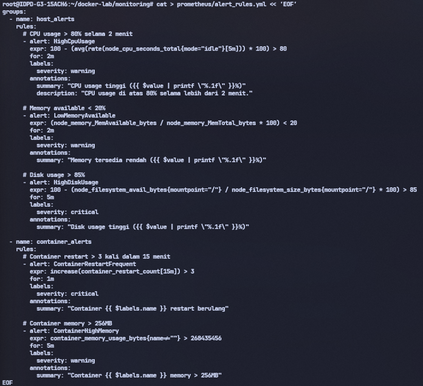
*Gambar 1.2: Screenshot hasil pembuatan `prometheus/alert_rules.yml`.*

---

### Langkah 2: Konfigurasi Grafana (Provisioning)

#### 2.1 Provisioning data source

```bash
cat > grafana/provisioning/datasources/datasources.yml << 'EOF'
apiVersion: 1

datasources:
  # --- Prometheus (metrics) ---
  - name: Prometheus
    type: prometheus
    access: proxy
    url: http://prometheus:9090
    isDefault: true
    editable: true
    jsonData:
      timeInterval: "15s"

  # --- PostgreSQL (logs dari Modul 5) ---
  - name: PostgreSQL-Logs
    type: postgres
    access: proxy
    url: postgres-db:5432
    database: labdb
    user: labuser
    secureJsonData:
      password: labpass123
    jsonData:
      sslmode: disable
      maxOpenConns: 5
      postgresVersion: 1600
      timescaledb: false
    editable: true
EOF
```

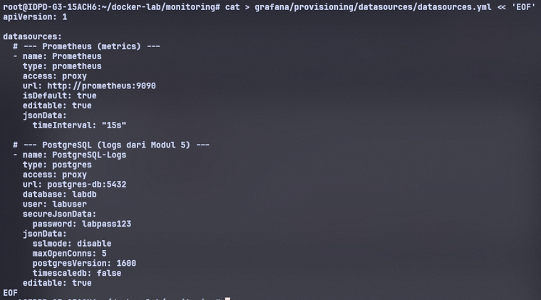
*Gambar 2.1: Screenshot hasil pembuatan `grafana/provisioning/datasources/datasources.yml`.*

#### 2.2 Provisioning dashboard

```bash
cat > grafana/provisioning/dashboards/dashboards.yml << 'EOF'
apiVersion: 1

providers:
  - name: "Lab PENS Dashboards"
    orgId: 1
    folder: "Lab PENS"
    type: file
    disableDeletion: false
    editable: true
    updateIntervalSeconds: 30
    options:
      path: /var/lib/grafana/dashboards
      foldersFromFilesStructure: false
EOF
```

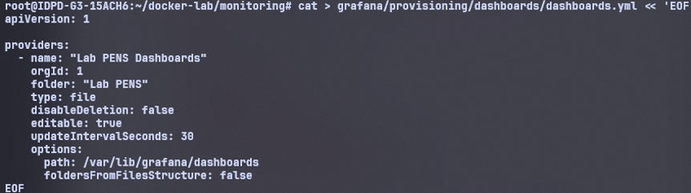
*Gambar 2.2: Screenshot hasil pembuatan `grafana/provisioning/dashboards/dashboards.yml`.*

#### 2.3 Buat Dashboard JSON: Docker Host Overview

```bash
cat > grafana/dashboards/docker-host-overview.json << 'JSONEOF'
{
  "annotations": { "list": [] },
  "editable": true,
  "fiscalYearStartMonth": 0,
  "graphTooltip": 1,
  "links": [],
  "panels": [
    {
      "title": "CPU Usage %",
      "type": "gauge",
      "gridPos": { "h": 6, "w": 6, "x": 0, "y": 0 },
      "datasource": { "type": "prometheus", "uid": "" },
      "fieldConfig": {
        "defaults": {
          "thresholds": {
            "mode": "absolute",
            "steps": [
              { "color": "green", "value": null },
              { "color": "yellow", "value": 60 },
              { "color": "red", "value": 85 }
            ]
          },
          "unit": "percent", "min": 0, "max": 100
        },
        "overrides": []
      },
      "targets": [{
        "expr": "100 - (avg(rate(node_cpu_seconds_total{mode=\"idle\"}[5m])) * 100)",
        "legendFormat": "CPU Usage"
      }]
    },
    {
      "title": "Memory Usage %",
      "type": "gauge",
      "gridPos": { "h": 6, "w": 6, "x": 6, "y": 0 },
      "datasource": { "type": "prometheus", "uid": "" },
      "fieldConfig": {
        "defaults": {
          "thresholds": {
            "mode": "absolute",
            "steps": [
              { "color": "green", "value": null },
              { "color": "yellow", "value": 70 },
              { "color": "red", "value": 90 }
            ]
          },
          "unit": "percent", "min": 0, "max": 100
        },
        "overrides": []
      },
      "targets": [{
        "expr": "100 - (node_memory_MemAvailable_bytes / node_memory_MemTotal_bytes * 100)",
        "legendFormat": "Memory Used"
      }]
    },
    {
      "title": "Disk Usage %",
      "type": "gauge",
      "gridPos": { "h": 6, "w": 6, "x": 12, "y": 0 },
      "datasource": { "type": "prometheus", "uid": "" },
      "fieldConfig": {
        "defaults": {
          "thresholds": {
            "mode": "absolute",
            "steps": [
              { "color": "green", "value": null },
              { "color": "yellow", "value": 70 },
              { "color": "red", "value": 85 }
            ]
          },
          "unit": "percent", "min": 0, "max": 100
        },
        "overrides": []
      },
      "targets": [{
        "expr": "100 - (node_filesystem_avail_bytes{mountpoint=\"/\"} / node_filesystem_size_bytes{mountpoint=\"/\"} * 100)",
        "legendFormat": "Disk Used"
      }]
    },
    {
      "title": "System Uptime",
      "type": "stat",
      "gridPos": { "h": 6, "w": 6, "x": 18, "y": 0 },
      "datasource": { "type": "prometheus", "uid": "" },
      "fieldConfig": { "defaults": { "unit": "s" }, "overrides": [] },
      "targets": [{
        "expr": "node_time_seconds - node_boot_time_seconds",
        "legendFormat": "Uptime"
      }]
    },
    {
      "title": "CPU Usage Over Time",
      "type": "timeseries",
      "gridPos": { "h": 8, "w": 12, "x": 0, "y": 6 },
      "datasource": { "type": "prometheus", "uid": "" },
      "fieldConfig": { "defaults": { "unit": "percent", "min": 0, "max": 100 }, "overrides": [] },
      "targets": [
        { "expr": "100 - (avg(rate(node_cpu_seconds_total{mode=\"idle\"}[5m])) * 100)", "legendFormat": "Total CPU %" },
        { "expr": "avg(rate(node_cpu_seconds_total{mode=\"user\"}[5m])) * 100", "legendFormat": "User" },
        { "expr": "avg(rate(node_cpu_seconds_total{mode=\"system\"}[5m])) * 100", "legendFormat": "System" },
        { "expr": "avg(rate(node_cpu_seconds_total{mode=\"iowait\"}[5m])) * 100", "legendFormat": "IOWait" }
      ]
    },
    {
      "title": "Memory Breakdown",
      "type": "timeseries",
      "gridPos": { "h": 8, "w": 12, "x": 12, "y": 6 },
      "datasource": { "type": "prometheus", "uid": "" },
      "fieldConfig": { "defaults": { "unit": "bytes" }, "overrides": [] },
      "options": { "tooltip": { "mode": "multi" } },
      "targets": [
        { "expr": "node_memory_MemTotal_bytes", "legendFormat": "Total" },
        { "expr": "node_memory_MemTotal_bytes - node_memory_MemAvailable_bytes", "legendFormat": "Used" },
        { "expr": "node_memory_MemAvailable_bytes", "legendFormat": "Available" },
        { "expr": "node_memory_Cached_bytes", "legendFormat": "Cached" },
        { "expr": "node_memory_Buffers_bytes", "legendFormat": "Buffers" }
      ]
    },
    {
      "title": "Network Traffic (eth0)",
      "type": "timeseries",
      "gridPos": { "h": 8, "w": 12, "x": 0, "y": 14 },
      "datasource": { "type": "prometheus", "uid": "" },
      "fieldConfig": { "defaults": { "unit": "Bps" }, "overrides": [] },
      "targets": [
        { "expr": "rate(node_network_receive_bytes_total{device=\"eth0\"}[5m])", "legendFormat": "Received" },
        { "expr": "rate(node_network_transmit_bytes_total{device=\"eth0\"}[5m])", "legendFormat": "Transmitted" }
      ]
    },
    {
      "title": "Disk I/O",
      "type": "timeseries",
      "gridPos": { "h": 8, "w": 12, "x": 12, "y": 14 },
      "datasource": { "type": "prometheus", "uid": "" },
      "fieldConfig": { "defaults": { "unit": "Bps" }, "overrides": [] },
      "targets": [
        { "expr": "rate(node_disk_read_bytes_total[5m])", "legendFormat": "Read {{ device }}" },
        { "expr": "rate(node_disk_written_bytes_total[5m])", "legendFormat": "Write {{ device }}" }
      ]
    }
  ],
  "schemaVersion": 39,
  "tags": ["pens", "docker", "host"],
  "templating": { "list": [] },
  "time": { "from": "now-1h", "to": "now" },
  "title": "Docker Host Overview",
  "uid": "pens-host-overview"
}
JSONEOF
```

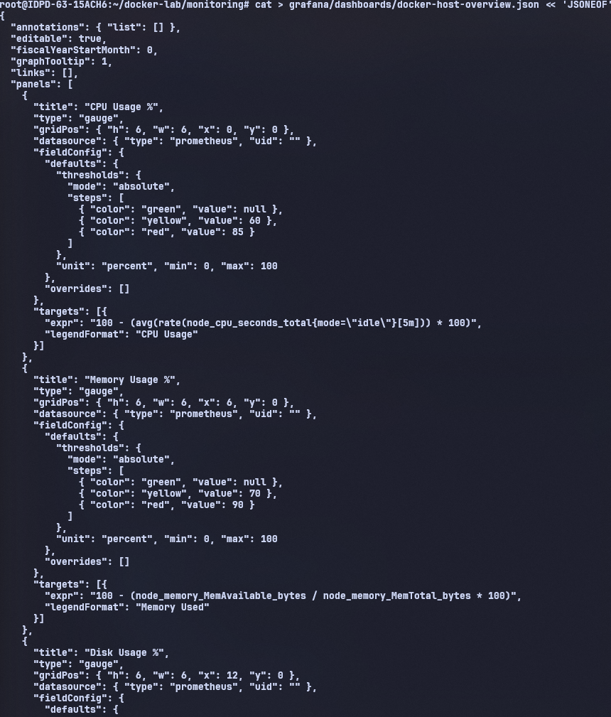
*Gambar 2.3a: Screenshot hasil pembuatan dashboard JSON `docker-host-overview.json` — bagian awal panel.*

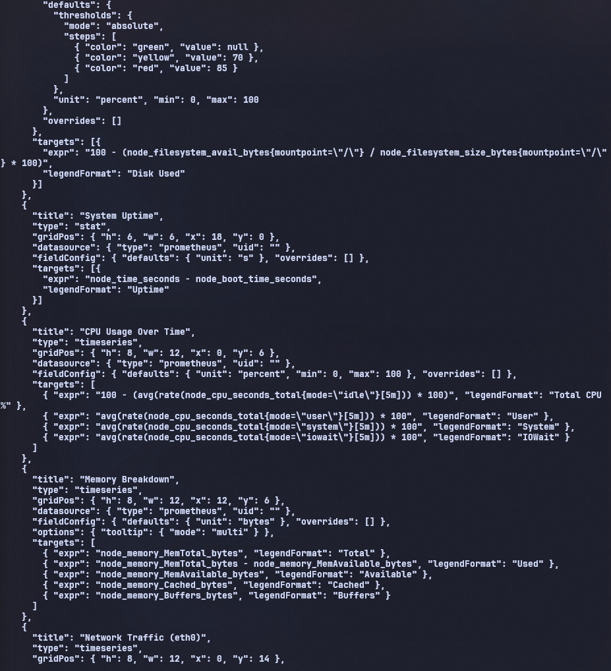
*Gambar 2.3b: Screenshot lanjutan panel Docker Host Overview — CPU, Memory, dan Disk gauge.*

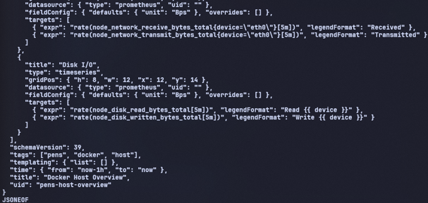
*Gambar 2.3c: Screenshot panel time-series CPU Usage Over Time dan Memory Breakdown.*

#### 2.4 Buat Dashboard JSON: Container Metrics

```bash
cat > grafana/dashboards/container-metrics.json << 'JSONEOF'
{
  "annotations": { "list": [] },
  "editable": true,
  "panels": [
    {
      "title": "Running Containers",
      "type": "stat",
      "gridPos": { "h": 4, "w": 6, "x": 0, "y": 0 },
      "datasource": { "type": "prometheus", "uid": "" },
      "fieldConfig": { "defaults": { "color": { "mode": "thresholds" }, "thresholds": { "steps": [{ "color": "green", "value": null }] } }, "overrides": [] },
      "targets": [{ "expr": "count(container_last_seen{name!=\"\"})", "legendFormat": "Containers" }]
    },
    {
      "title": "Total Container CPU Usage",
      "type": "stat",
      "gridPos": { "h": 4, "w": 6, "x": 6, "y": 0 },
      "datasource": { "type": "prometheus", "uid": "" },
      "fieldConfig": { "defaults": { "unit": "percent", "thresholds": { "steps": [{ "color": "green", "value": null }, { "color": "red", "value": 80 }] } }, "overrides": [] },
      "targets": [{ "expr": "sum(rate(container_cpu_usage_seconds_total{name!=\"\"}[5m])) * 100", "legendFormat": "Total CPU" }]
    },
    {
      "title": "Total Container Memory",
      "type": "stat",
      "gridPos": { "h": 4, "w": 6, "x": 12, "y": 0 },
      "datasource": { "type": "prometheus", "uid": "" },
      "fieldConfig": { "defaults": { "unit": "bytes", "thresholds": { "steps": [{ "color": "green", "value": null }] } }, "overrides": [] },
      "targets": [{ "expr": "sum(container_memory_usage_bytes{name!=\"\"})", "legendFormat": "Total Memory" }]
    },
    {
      "title": "Prometheus Alerts Active",
      "type": "stat",
      "gridPos": { "h": 4, "w": 6, "x": 18, "y": 0 },
      "datasource": { "type": "prometheus", "uid": "" },
      "fieldConfig": { "defaults": { "thresholds": { "steps": [{ "color": "green", "value": null }, { "color": "red", "value": 1 }] } }, "overrides": [] },
      "targets": [{ "expr": "count(ALERTS{alertstate=\"firing\"}) OR vector(0)", "legendFormat": "Firing" }]
    },
    {
      "title": "CPU Usage per Container",
      "type": "timeseries",
      "gridPos": { "h": 8, "w": 12, "x": 0, "y": 4 },
      "datasource": { "type": "prometheus", "uid": "" },
      "fieldConfig": { "defaults": { "unit": "percent" }, "overrides": [] },
      "targets": [{ "expr": "rate(container_cpu_usage_seconds_total{name!=\"\"}[5m]) * 100", "legendFormat": "{{ name }}" }]
    },
    {
      "title": "Memory Usage per Container",
      "type": "timeseries",
      "gridPos": { "h": 8, "w": 12, "x": 12, "y": 4 },
      "datasource": { "type": "prometheus", "uid": "" },
      "fieldConfig": { "defaults": { "unit": "bytes" }, "overrides": [] },
      "targets": [{ "expr": "container_memory_usage_bytes{name!=\"\"}", "legendFormat": "{{ name }}" }]
    },
    {
      "title": "Container Network RX",
      "type": "timeseries",
      "gridPos": { "h": 8, "w": 12, "x": 0, "y": 12 },
      "datasource": { "type": "prometheus", "uid": "" },
      "fieldConfig": { "defaults": { "unit": "Bps" }, "overrides": [] },
      "targets": [{ "expr": "rate(container_network_receive_bytes_total{name!=\"\"}[5m])", "legendFormat": "{{ name }}" }]
    },
    {
      "title": "Container Network TX",
      "type": "timeseries",
      "gridPos": { "h": 8, "w": 12, "x": 12, "y": 12 },
      "datasource": { "type": "prometheus", "uid": "" },
      "fieldConfig": { "defaults": { "unit": "Bps" }, "overrides": [] },
      "targets": [{ "expr": "rate(container_network_transmit_bytes_total{name!=\"\"}[5m])", "legendFormat": "{{ name }}" }]
    }
  ],
  "schemaVersion": 39,
  "tags": ["pens", "docker", "containers"],
  "time": { "from": "now-1h", "to": "now" },
  "title": "Container Metrics",
  "uid": "pens-container-metrics"
}
JSONEOF
```

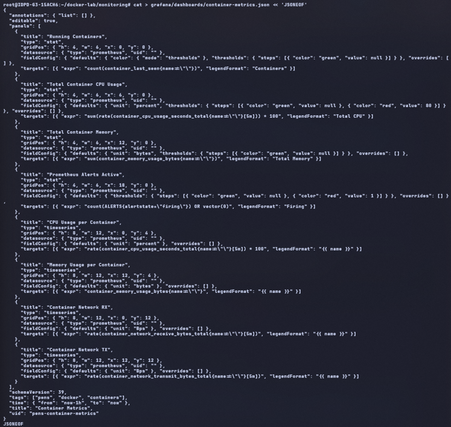
*Gambar 2.4: Screenshot hasil pembuatan dashboard JSON `container-metrics.json`.*

#### 2.5 Buat Dashboard JSON: Log Analytics (PostgreSQL)

```bash
cat > grafana/dashboards/log-analytics.json << 'JSONEOF'
{
  "annotations": { "list": [] },
  "editable": true,
  "panels": [
    {
      "title": "Total Logs (All Time)",
      "type": "stat",
      "gridPos": { "h": 4, "w": 6, "x": 0, "y": 0 },
      "datasource": { "type": "postgres", "uid": "" },
      "fieldConfig": { "defaults": { "thresholds": { "steps": [{ "color": "blue", "value": null }] } }, "overrides": [] },
      "targets": [{ "rawSql": "SELECT COUNT(*) AS total FROM logs.fluentbit;", "format": "table" }]
    },
    {
      "title": "Errors Last Hour",
      "type": "stat",
      "gridPos": { "h": 4, "w": 6, "x": 6, "y": 0 },
      "datasource": { "type": "postgres", "uid": "" },
      "fieldConfig": { "defaults": { "thresholds": { "steps": [{ "color": "green", "value": null }, { "color": "red", "value": 10 }] } }, "overrides": [] },
      "targets": [{ "rawSql": "SELECT COUNT(*) AS errors FROM logs.fluentbit WHERE data->>'log' IS NOT NULL AND LEFT(TRIM(data->>'log'),1)='{' AND (data->>'log')::jsonb->>'level' IN ('ERROR','CRITICAL') AND time > NOW() - INTERVAL '1 hour';", "format": "table" }]
    },
    {
      "title": "Log Volume per Minute",
      "type": "timeseries",
      "gridPos": { "h": 8, "w": 24, "x": 0, "y": 4 },
      "datasource": { "type": "postgres", "uid": "" },
      "targets": [{ "rawSql": "SELECT date_trunc('minute', time) AS time, COUNT(*) AS count FROM logs.fluentbit WHERE $__timeFilter(time) GROUP BY 1 ORDER BY 1;", "format": "time_series" }]
    },
    {
      "title": "Log Level Distribution",
      "type": "piechart",
      "gridPos": { "h": 8, "w": 8, "x": 0, "y": 12 },
      "datasource": { "type": "postgres", "uid": "" },
      "targets": [{ "rawSql": "SELECT (data->>'log')::jsonb->>'level' AS metric, COUNT(*) AS value FROM logs.fluentbit WHERE time > NOW() - INTERVAL '1 hour' AND data->>'log' IS NOT NULL AND LEFT(TRIM(data->>'log'),1)='{' GROUP BY metric ORDER BY value DESC;", "format": "table" }]
    },
    {
      "title": "Logs per Container",
      "type": "barchart",
      "gridPos": { "h": 8, "w": 8, "x": 8, "y": 12 },
      "datasource": { "type": "postgres", "uid": "" },
      "targets": [{ "rawSql": "SELECT tag AS metric, COUNT(*) AS value FROM logs.fluentbit WHERE time > NOW() - INTERVAL '1 hour' GROUP BY tag ORDER BY value DESC;", "format": "table" }]
    },
    {
      "title": "Recent Errors & Critical",
      "type": "table",
      "gridPos": { "h": 8, "w": 8, "x": 16, "y": 12 },
      "datasource": { "type": "postgres", "uid": "" },
      "targets": [{ "rawSql": "SELECT to_char(time, 'HH24:MI:SS') AS time, REPLACE(data->>'container_name','/','') AS container, (data->>'log')::jsonb->>'level' AS level, LEFT((data->>'log')::jsonb->>'message',120) AS message FROM logs.fluentbit WHERE data->>'log' IS NOT NULL AND LEFT(TRIM(data->>'log'),1)='{' AND (data->>'log')::jsonb->>'level' IN ('ERROR','CRITICAL') ORDER BY time DESC LIMIT 20;", "format": "table" }]
    }
  ],
  "schemaVersion": 39,
  "tags": ["pens", "logs", "postgresql"],
  "time": { "from": "now-1h", "to": "now" },
  "title": "Log Analytics (PostgreSQL)",
  "uid": "pens-log-analytics"
}
JSONEOF
```

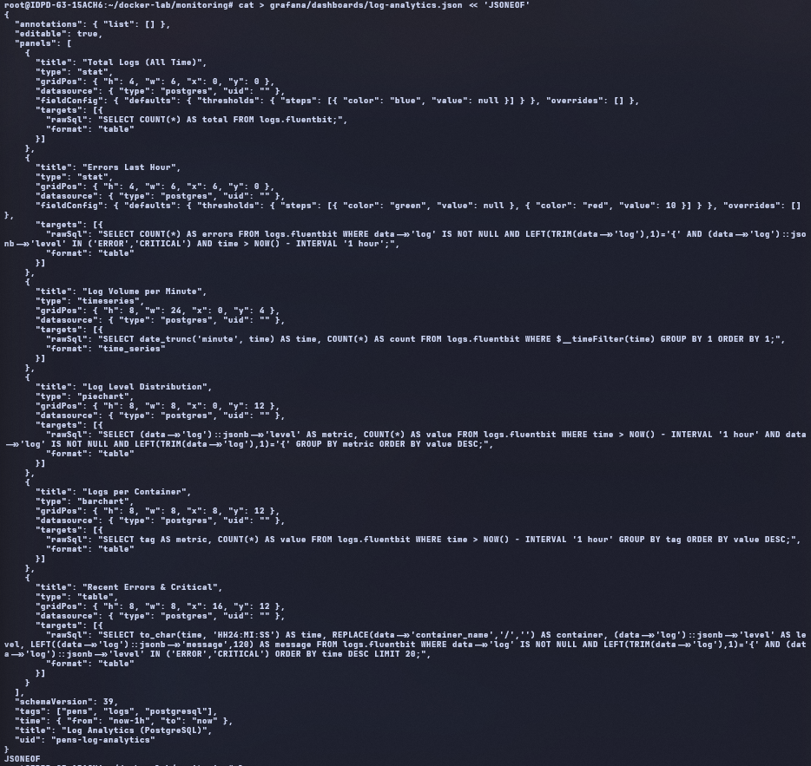
*Gambar 2.5: Screenshot hasil pembuatan dashboard JSON `log-analytics.json`.*

---

### Langkah 3: Buat Flask App dengan Prometheus Metrics

```bash
cat > app/requirements.txt << 'EOF'
flask==3.1.*
psycopg2-binary==2.9.*
prometheus-client==0.21.*
EOF
```

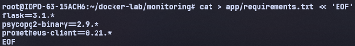
*Gambar 3.1: Screenshot hasil pembuatan `app/requirements.txt`.*

```bash
cat > app/app.py << 'PYEOF'
"""Flask app dengan Prometheus metrics endpoint dan structured logging."""

import os, json, socket, datetime, logging, sys, time
from flask import Flask, jsonify, request, Response
import psycopg2
from prometheus_client import Counter, Histogram, Gauge, generate_latest, CONTENT_TYPE_LATEST

app = Flask(__name__)

# --- Prometheus Metrics ---
REQUEST_COUNT = Counter(
    "flask_http_requests_total",
    "Total HTTP requests",
    ["method", "endpoint", "status"]
)
REQUEST_LATENCY = Histogram(
    "flask_http_request_duration_seconds",
    "HTTP request latency",
    ["method", "endpoint"],
    buckets=[0.01, 0.05, 0.1, 0.25, 0.5, 1.0, 2.5, 5.0]
)
DB_CONNECTIONS = Gauge(
    "flask_db_connections_active",
    "Active database connections"
)
LOG_COUNT = Gauge(
    "flask_log_total_count",
    "Total logs in PostgreSQL"
)

# --- Structured JSON Logging ---
class JSONFormatter(logging.Formatter):
    def format(self, record):
        return json.dumps({
            "timestamp": datetime.datetime.now().isoformat(),
            "level": record.levelname,
            "hostname": socket.gethostname(),
            "service": "flask-app",
            "message": record.getMessage()
        })

handler = logging.StreamHandler(sys.stdout)
handler.setFormatter(JSONFormatter())
app.logger.handlers = [handler]
app.logger.setLevel(logging.INFO)

DB = dict(host=os.environ.get("DB_HOST", "postgres-db"),
          dbname=os.environ.get("DB_NAME", "labdb"),
          user=os.environ.get("DB_USER", "labuser"),
          password=os.environ.get("DB_PASS", "labpass123"))

@app.before_request
def before():
    request._start_time = time.time()

@app.after_request
def after(response):
    latency = time.time() - getattr(request, "_start_time", time.time())
    endpoint = request.endpoint or "unknown"
    REQUEST_COUNT.labels(request.method, endpoint, response.status_code).inc()
    REQUEST_LATENCY.labels(request.method, endpoint).observe(latency)
    return response

@app.route("/")
def index():
    app.logger.info(f"Index accessed from {request.remote_addr}")
    return jsonify({"service": "flask-app", "status": "running",
                    "hostname": socket.gethostname()})

@app.route("/metrics")
def metrics():
    """Prometheus metrics endpoint."""
    try:
        conn = psycopg2.connect(**DB); cur = conn.cursor()
        cur.execute("SELECT COUNT(*) FROM logs.fluentbit")
        LOG_COUNT.set(cur.fetchone()[0])
        cur.execute("SELECT count(*) FROM pg_stat_activity WHERE datname = %s", (DB["dbname"],))
        DB_CONNECTIONS.set(cur.fetchone()[0])
        cur.close(); conn.close()
    except Exception:
        pass
    return Response(generate_latest(), mimetype=CONTENT_TYPE_LATEST)

@app.route("/api/health")
def health():
    try:
        conn = psycopg2.connect(**DB); cur = conn.cursor()
        cur.execute("SELECT version();")
        ver = cur.fetchone()[0]; cur.close(); conn.close()
        return jsonify({"status": "ok", "database": ver, "db_status": "connected"})
    except Exception as e:
        return jsonify({"status": "error", "db_status": str(e)}), 500

@app.route("/api/logs/stats")
def log_stats():
    try:
        conn = psycopg2.connect(**DB); cur = conn.cursor()
        cur.execute("""SELECT (data->>'log')::jsonb->>'level' AS level, COUNT(*)
                       FROM logs.fluentbit
                       WHERE time > NOW() - INTERVAL '1 hour'
                         AND data->>'log' IS NOT NULL
                         AND LEFT(TRIM(data->>'log'),1) = '{'
                       GROUP BY level ORDER BY count DESC""")
        stats = [{"level": r[0], "count": r[1]} for r in cur.fetchall()]
        cur.execute("SELECT COUNT(*) FROM logs.fluentbit")
        total = cur.fetchone()[0]; cur.close(); conn.close()
        return jsonify({"total_logs": total, "last_hour": stats})
    except Exception as e:
        return jsonify({"error": str(e)}), 500

if __name__ == "__main__":
    app.run(host="0.0.0.0", port=5000)
PYEOF
```

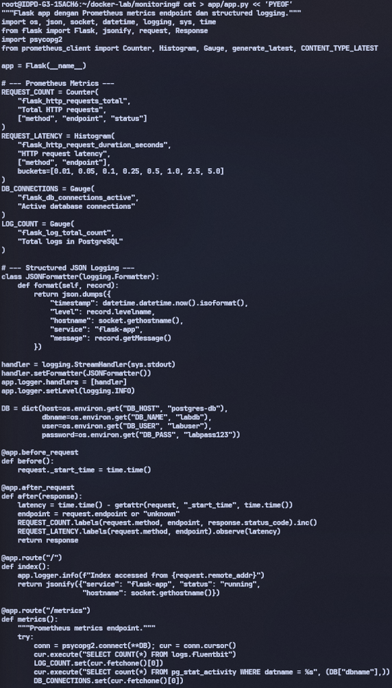
*Gambar 3.2a: Screenshot hasil pembuatan `app/app.py` — bagian awal dengan Prometheus metrics dan formatter.*

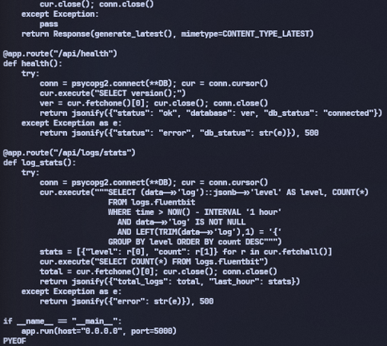
*Gambar 3.2b: Screenshot lanjutan `app/app.py` — routes dan endpoint definition.*

```bash
cat > app/Dockerfile << 'EOF'
FROM python:3.11-slim
WORKDIR /app
COPY requirements.txt .
RUN pip install --no-cache-dir -r requirements.txt
COPY app.py .
EXPOSE 5000
CMD ["python", "-u", "app.py"]
EOF
```

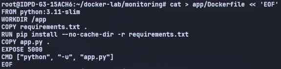
*Gambar 3.3: Screenshot hasil pembuatan `app/Dockerfile`.*

---

### Langkah 4: Siapkan Fluent Bit, Log Generator, dan Init Script

```bash
# --- Fluent Bit ---
cat > fluent-bit/fluent-bit.conf << 'EOF'
[SERVICE]
    Flush 5
    Daemon Off
    Log_Level info
    Parsers_File parsers.conf

[INPUT]
    Name forward
    Listen 0.0.0.0
    Port 24224

[OUTPUT]
    Name pgsql
    Match *
    Host postgres-db
    Port 5432
    User labuser
    Password labpass123
    Database labdb
    Table fluentbit
    Schema logs
    Timestamp_Key time
    Async false
    min_pool_size 1
    max_pool_size 4

[OUTPUT]
    Name stdout
    Match *
    Format json_lines
EOF
```

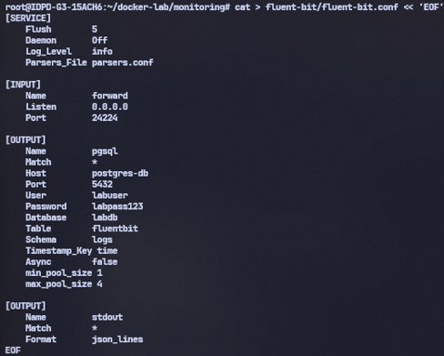
*Gambar 4.1: Screenshot hasil pembuatan `fluent-bit/fluent-bit.conf`.*

```bash
# --- Log Generator ---
cat > generator/generator.py << 'PYEOF'
import json, time, random, socket, datetime, os

HOSTNAME = socket.gethostname()
INTERVAL = float(os.environ.get("LOG_INTERVAL", "3"))

EVENTS = [
    {"level": "INFO", "weight": 50, "msgs": [
        "User login successful", "Page loaded in {ms}ms",
        "API GET /api/users completed", "Health check passed"]},
    {"level": "DEBUG", "weight": 20, "msgs": [
        "DB query {ms}ms", "Cache hit key:product_{pid}"]},
    {"level": "WARN", "weight": 15, "msgs": [
        "Slow query {ms}ms", "Memory at {mem}%", "Rate limit near"]},
    {"level": "ERROR", "weight": 10, "msgs": [
        "DB connection timeout", "HTTP 500 on /api/checkout",
        "Payment gateway error {code}"]},
    {"level": "CRITICAL", "weight": 5, "msgs": [
        "Connection pool exhausted", "OOM kill triggered"]}
]

def pick():
    total = sum(e["weight"] for e in EVENTS)
    r = random.uniform(0, total); c = 0
    for e in EVENTS:
        c += e["weight"]
        if r <= c: return e
    return EVENTS[0]

while True:
    e = pick(); msg = random.choice(e["msgs"]).format(
        ms=random.randint(5,3000), pid=random.randint(1,500),
        mem=random.randint(60,98), code=random.choice([400,500,502,503]))
    print(json.dumps({"timestamp": datetime.datetime.now().isoformat(),
                      "level": e["level"], "hostname": HOSTNAME,
                      "service": "log-generator", "message": msg}), flush=True)
    time.sleep(INTERVAL + random.uniform(-0.5, 0.5))
PYEOF
```

```bash
cat > generator/Dockerfile << 'EOF'
FROM python:3.11-alpine
WORKDIR /app
COPY generator.py .
CMD ["python", "-u", "generator.py"]
EOF
```

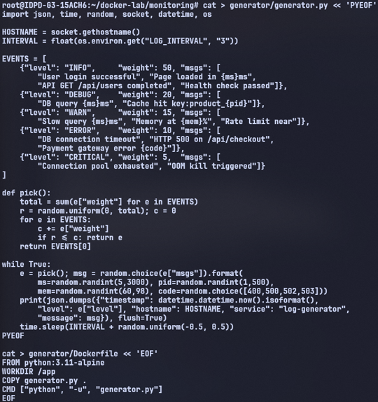
*Gambar 4.2: Screenshot hasil pembuatan `generator/generator.py` dan `generator/Dockerfile`.*

```bash
# --- Init SQL (dari Modul 5 -- schema sesuai Fluent Bit pgsql plugin) ---
cat > init/01-logging-schema.sql << 'EOF'
CREATE SCHEMA IF NOT EXISTS logs;

-- Tabel: format sesuai Fluent Bit pgsql plugin (tag, time, data)
CREATE TABLE IF NOT EXISTS logs.fluentbit (
    id BIGSERIAL PRIMARY KEY,
    tag VARCHAR(200),
    time TIMESTAMP,
    data JSONB
);

CREATE INDEX IF NOT EXISTS idx_fb_time ON logs.fluentbit(time);
CREATE INDEX IF NOT EXISTS idx_fb_tag ON logs.fluentbit(tag);
CREATE INDEX IF NOT EXISTS idx_fb_data ON logs.fluentbit USING GIN(data);

-- View: log terbaru
CREATE OR REPLACE VIEW logs.recent_logs AS
SELECT id, to_char(time, 'YYYY-MM-DD HH24:MI:SS') AS time, tag,
       REPLACE(data->>'container_name', '/', '') AS container,
       data->>'source' AS source,
       LEFT(data->>'log', 200) AS log_preview
FROM logs.fluentbit ORDER BY time DESC LIMIT 100;

-- View: structured JSON logs (parsed level & message)
CREATE OR REPLACE VIEW logs.structured_logs AS
SELECT id, time AS received_at, tag,
       REPLACE(data->>'container_name', '/', '') AS container_name,
       (data->>'log')::jsonb->>'level' AS log_level,
       (data->>'log')::jsonb->>'message' AS message,
       (data->>'log')::jsonb->>'service' AS service
FROM logs.fluentbit
WHERE data->>'log' IS NOT NULL AND LEFT(TRIM(data->>'log'), 1) = '{'
ORDER BY time DESC;

-- View: error summary
CREATE OR REPLACE VIEW logs.error_summary AS
SELECT REPLACE(data->>'container_name', '/', '') AS container_name,
       (data->>'log')::jsonb->>'level' AS log_level,
       COUNT(*) AS count, MAX(time) AS last_seen
FROM logs.fluentbit
WHERE data->>'log' IS NOT NULL AND LEFT(TRIM(data->>'log'), 1) = '{'
  AND (data->>'log')::jsonb->>'level' IN ('ERROR', 'WARN', 'CRITICAL')
GROUP BY 1, 2 ORDER BY count DESC;
EOF
```

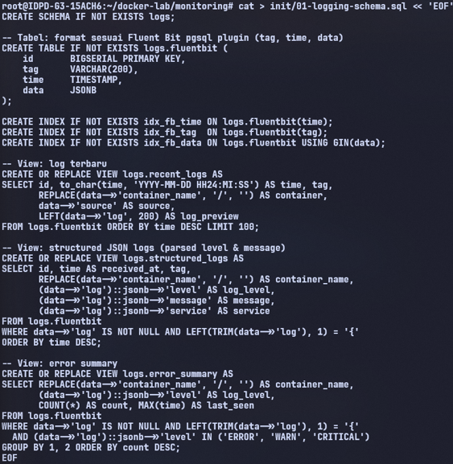
*Gambar 4.3: Screenshot hasil pembuatan `init/01-logging-schema.sql`.*

---

### Langkah 5: Docker Compose — Full Monitoring Stack

```bash
cat > docker-compose.yml << 'EOF'
services:

  # ============================================
  # MONITORING LAYER
  # ============================================

  # --- Prometheus (Metrics TSDB) ---
  prometheus:
    image: prom/prometheus:latest
    container_name: prometheus
    ports:
      - "9090:9090"
    volumes:
      - ./prometheus/prometheus.yml:/etc/prometheus/prometheus.yml:ro
      - ./prometheus/alert_rules.yml:/etc/prometheus/alert_rules.yml:ro
      - prom-data:/prometheus
    command:
      - "--config.file=/etc/prometheus/prometheus.yml"
      - "--storage.tsdb.path=/prometheus"
      - "--storage.tsdb.retention.time=7d"
      - "--web.enable-lifecycle"
    networks:
      - monitoring-net
    restart: unless-stopped

  # --- Node Exporter (Host Metrics) ---
  node-exporter:
    image: prom/node-exporter:latest
    container_name: node-exporter
    ports:
      - "9100:9100"
    volumes:
      - /proc:/host/proc:ro
      - /sys:/host/sys:ro
      - /:/rootfs:ro
    command:
      - "--path.procfs=/host/proc"
      - "--path.sysfs=/host/sys"
      - "--path.rootfs=/rootfs"
      - "--collector.filesystem.mount-points-exclude=^/(sys|proc|dev|host|etc)($$|/)"
    networks:
      - monitoring-net
    restart: unless-stopped

  # --- cAdvisor (Container Metrics) ---
  cadvisor:
    image: gcr.io/cadvisor/cadvisor:latest
    container_name: cadvisor
    ports:
      - "8081:8080"
    volumes:
      - /:/rootfs:ro
      - /var/run:/var/run:ro
      - /sys:/sys:ro
      - /var/lib/docker/:/var/lib/docker:ro
      - /dev/disk/:/dev/disk:ro
    privileged: true
    devices:
      - /dev/kmsg
    networks:
      - monitoring-net
    restart: unless-stopped

  # --- Grafana (Visualization) ---
  grafana:
    image: grafana/grafana:latest
    container_name: grafana
    ports:
      - "3000:3000"
    environment:
      GF_SECURITY_ADMIN_USER: admin
      GF_SECURITY_ADMIN_PASSWORD: admin123
      GF_USERS_ALLOW_SIGN_UP: "false"
      GF_DASHBOARDS_DEFAULT_HOME_DASHBOARD_PATH: /var/lib/grafana/dashboards/docker-host-overview.json
    volumes:
      - grafana-data:/var/lib/grafana
      - ./grafana/provisioning:/etc/grafana/provisioning:ro
      - ./grafana/dashboards:/var/lib/grafana/dashboards:ro
    networks:
      - monitoring-net
    depends_on:
      - prometheus
      - postgres-db
    restart: unless-stopped

  # ============================================
  # LOGGING LAYER (dari Modul 5)
  # ============================================
  fluent-bit:
    image: fluent/fluent-bit:latest
    container_name: fluent-bit
    ports:
      - "24224:24224"
      - "24224:24224/udp"
    volumes:
      - ./fluent-bit/fluent-bit.conf:/fluent-bit/etc/fluent-bit.conf:ro
      - ./fluent-bit/parsers.conf:/fluent-bit/etc/parsers.conf:ro
    networks:
      - monitoring-net
    depends_on:
      postgres-db:
        condition: service_healthy
    restart: unless-stopped

  # ============================================
  # DATA LAYER
  # ============================================
  postgres-db:
    image: postgres:16-alpine
    container_name: postgres-db
    environment:
      POSTGRES_DB: labdb
      POSTGRES_USER: labuser
      POSTGRES_PASSWORD: labpass123
      TZ: Asia/Jakarta
    ports:
      - "5432:5432"
    volumes:
      - pg-data:/var/lib/postgresql/data
      - ./init:/docker-entrypoint-initdb.d:ro
    networks:
      - monitoring-net
    healthcheck:
      test: ["CMD-SHELL", "pg_isready -U labuser -d labdb"]
      interval: 10s
      timeout: 5s
      retries: 5
    restart: unless-stopped

  # ============================================
  # APPLICATION LAYER
  # ============================================
  nginx-web:
    image: nginx:alpine
    container_name: nginx-web
    ports:
      - "8080:80"
    networks:
      - monitoring-net
    logging:
      driver: fluentd
      options:
        fluentd-address: "localhost:24224"
        fluentd-async: "true"
        tag: "docker.nginx"
    depends_on:
      - fluent-bit
    restart: unless-stopped

  flask-app:
    build: ./app
    container_name: flask-app
    environment:
      - DB_HOST=postgres-db
      - DB_NAME=labdb
      - DB_USER=labuser
      - DB_PASS=labpass123
    ports:
      - "5000:5000"
    networks:
      - monitoring-net
    logging:
      driver: fluentd
      options:
        fluentd-address: "localhost:24224"
        fluentd-async: "true"
        tag: "docker.flask"
    depends_on:
      - fluent-bit
      - postgres-db
    restart: unless-stopped

  log-generator:
    build: ./generator
    container_name: log-generator
    environment:
      - LOG_INTERVAL=3
    networks:
      - monitoring-net
    logging:
      driver: fluentd
      options:
        fluentd-address: "localhost:24224"
        fluentd-async: "true"
        tag: "docker.generator"
    depends_on:
      - fluent-bit
    restart: unless-stopped

volumes:
  prom-data:
  grafana-data:
  pg-data:

networks:
  monitoring-net:
EOF
```

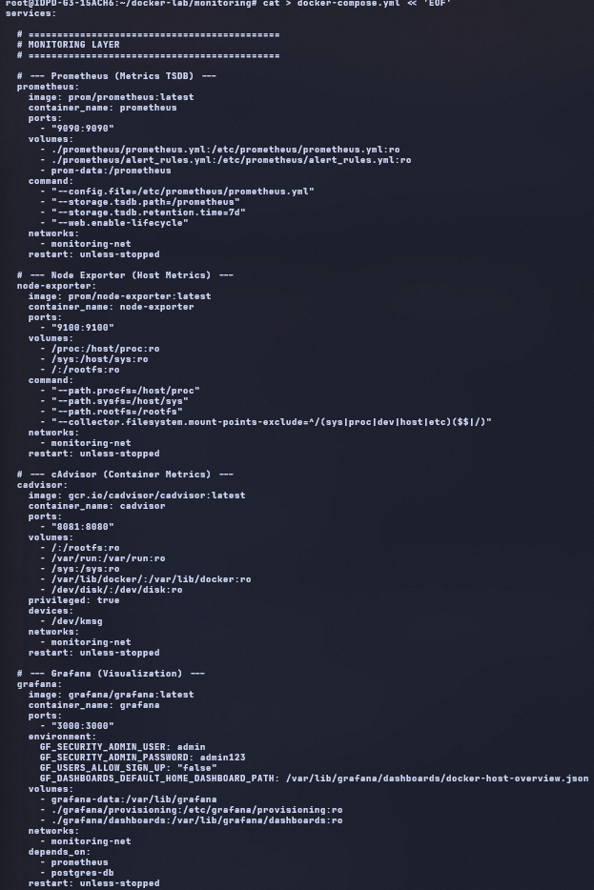
*Gambar 5.1a: Screenshot `docker-compose.yml` — monitoring layer (Prometheus, Node Exporter, cAdvisor, Grafana).*

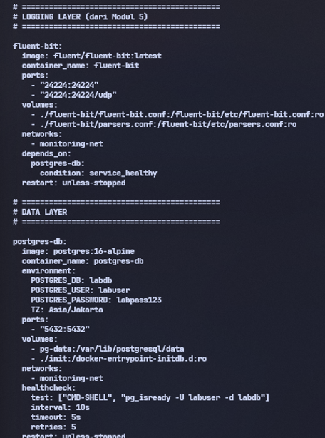
*Gambar 5.1b: Screenshot `docker-compose.yml` — logging layer (Fluent Bit) dan data layer (PostgreSQL).*

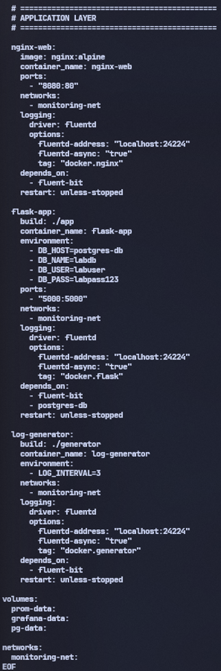
*Gambar 5.1c: Screenshot `docker-compose.yml` — application layer (Nginx, Flask, Log Generator).*

---

### Langkah 6: Deploy Full Stack

```bash
# Build dan jalankan seluruh stack (9 container)
docker compose up --build -d
```

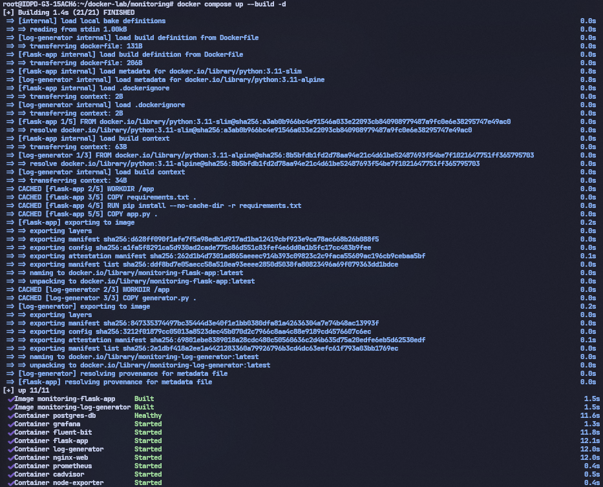
*Gambar 6.1: Screenshot hasil `docker compose up --build -d` — seluruh container berjalan.*

```bash
# Cek semua service
docker compose ps
```

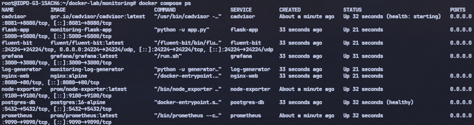
*Gambar 6.2: Screenshot hasil `docker compose ps` — 9 container dengan status Up.*

```bash
# Tunggu 30 detik agar metrics terkumpul
sleep 30
```

---

### Langkah 7: Verifikasi Setiap Komponen

#### 7.1 Verifikasi Prometheus

```bash
# Akses Prometheus UI
echo "Buka browser: http://localhost:9090"
```


*Gambar 7.1: Screenshot halaman utama Prometheus UI di http://localhost:9090.*

```bash
# Cek targets — harus semua UP
curl -s http://localhost:9090/api/v1/targets | python3 -m json.tool | head -40
```

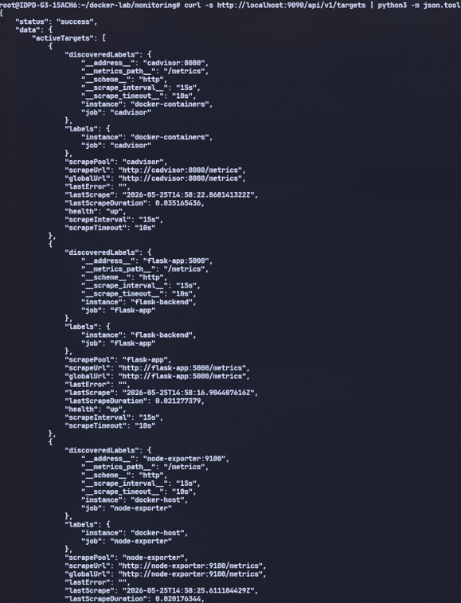
*Gambar 7.2a: Screenshot hasil `curl` cek targets Prometheus — memperlihatkan daftar target scrape.*

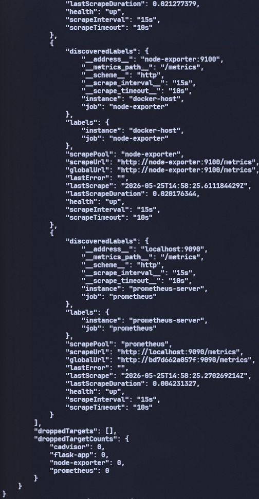
*Gambar 7.2b: Screenshot detail status targets Prometheus — semua endpoint UP dengan label masing-masing.*

```bash
# Test query PromQL via API
# CPU usage
curl -G http://localhost:9090/api/v1/query \
  --data-urlencode 'query=100-(avg(rate(node_cpu_seconds_total{mode="idle"}[5m]))*100)' \
  | python3 -m json.tool
```

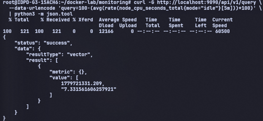
*Gambar 7.3: Screenshot hasil query PromQL CPU usage via Prometheus API.*

```bash
# Memory available
curl -s "http://localhost:9090/api/v1/query?query=node_memory_MemAvailable_bytes" \
  | python3 -m json.tool
```

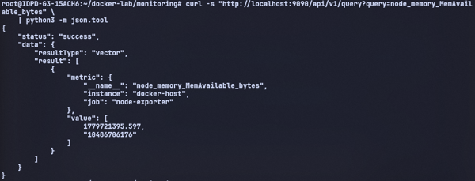
*Gambar 7.4: Screenshot hasil query PromQL memory available via Prometheus API.*

```bash
# Container count
curl -G http://localhost:9090/api/v1/query \
  --data-urlencode 'query=count(container_last_seen{name!=""})' \
  | python3 -m json.tool
```

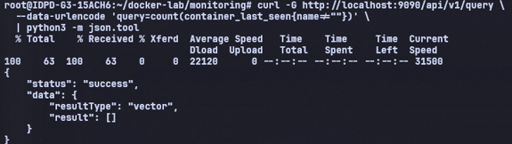
*Gambar 7.5: Screenshot hasil query jumlah container via Prometheus API.*

> Buka http://localhost:9090 → **Status → Targets** → pastikan semua target berstatus **UP**.

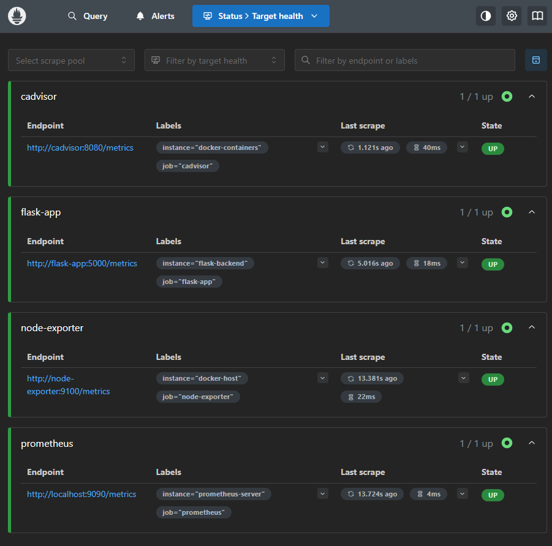
*Gambar 7.6: Screenshot Prometheus halaman Targets — semua target berstatus UP.*

#### 7.2 Verifikasi Node Exporter

```bash
# Cek metrik host langsung
curl -s http://localhost:9100/metrics | head -30
```

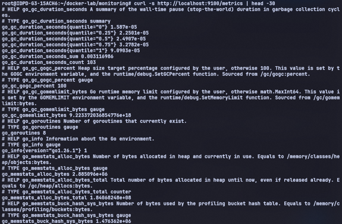
*Gambar 7.7: Screenshot hasil `curl http://localhost:9100/metrics` menampilkan metrik host.*

```bash
# Cek metrik spesifik
curl -s http://localhost:9100/metrics | grep "node_cpu_seconds_total" | head -5
curl -s http://localhost:9100/metrics | grep "node_memory_MemTotal_bytes"
curl -s http://localhost:9100/metrics | grep "node_filesystem_size_bytes" | head -3
```

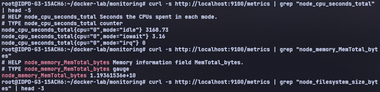
*Gambar 7.8: Screenshot hasil query metrik spesifik CPU, memory, dan filesystem dari Node Exporter.*

#### 7.3 Verifikasi cAdvisor

```bash
# Akses cAdvisor UI
echo "Buka browser: http://localhost:8081"
```


*Gambar 7.9: Screenshot halaman cAdvisor di http://localhost:8081.*

```bash
# Cek metrik container
curl -s http://localhost:8081/metrics | grep "container_memory_usage_bytes" | head -5
curl -s http://localhost:8081/metrics | grep "container_cpu_usage_seconds_total" | head -5
```

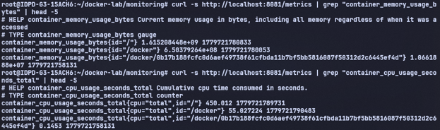
*Gambar 7.10: Screenshot hasil query metrik container dari cAdvisor.*

#### 7.4 Verifikasi Flask Prometheus Metrics

```bash
# Generate traffic
for i in $(seq 1 30); do curl -s http://localhost:5000/ > /dev/null; done
curl -s http://localhost:5000/api/health > /dev/null
curl -s http://localhost:5000/api/logs/stats > /dev/null
```

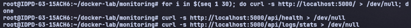
*Gambar 7.11: Screenshot hasil generate traffic ke Flask.*

```bash
# Cek metrics endpoint
curl -s http://localhost:5000/metrics | grep "flask_http_requests_total"
```

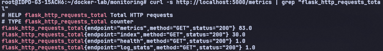
*Gambar 7.12: Screenshot hasil `curl http://localhost:5000/metrics | grep flask_http_requests_total`.*

```bash
curl -s http://localhost:5000/metrics | grep "flask_http_request_duration_seconds"
```

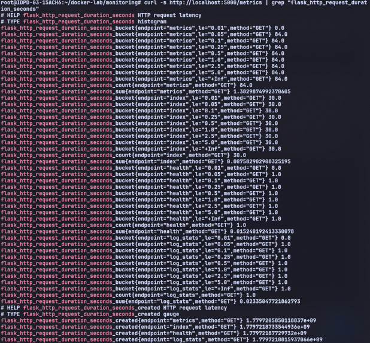
*Gambar 7.13: Screenshot hasil `curl http://localhost:5000/metrics | grep flask_http_request_duration_seconds`.*

```bash
curl -s http://localhost:5000/metrics | grep "flask_log_total_count"
```

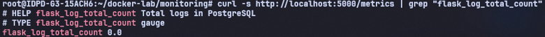
*Gambar 7.14: Screenshot hasil `curl http://localhost:5000/metrics | grep flask_log_total_count`.*

---

### Langkah 8: Eksplorasi Grafana Dashboard

#### 8.1 Login ke Grafana

1. Buka browser: http://localhost:3000
2. Login: `admin` / `admin123`
3. Skip change password (atau ganti sesuai keinginan)

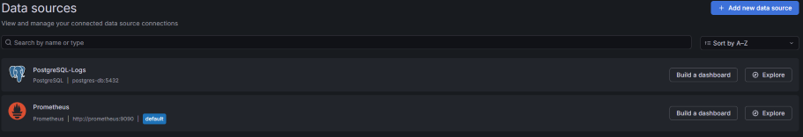
*Gambar 8.1: Screenshot halaman login Grafana.*

#### 8.2 Verifikasi Data Sources

1. Buka **Connections → Data sources** (menu kiri)
2. Pastikan ada 2 data source: **Prometheus** dan **PostgreSQL-Logs**

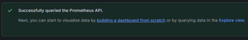
*Gambar 8.2: Screenshot halaman Data Sources Grafana — Prometheus dan PostgreSQL-Logs.*

3. Klik masing-masing → **Test** → harus "Data source is working"


*Gambar 8.3: Screenshot hasil test koneksi data source Prometheus.*


*Gambar 8.4: Screenshot hasil test koneksi data source PostgreSQL-Logs.*

#### 8.3 Eksplorasi Dashboard yang Sudah di-Provision

1. Buka **Dashboards** (menu kiri)
2. Buka folder **Lab PENS** → terdapat 3 dashboard:
   - **Docker Host Overview** — gauge CPU/Memory/Disk, grafik time-series
   - **Container Metrics** — CPU/Memory/Network per container
   - **Log Analytics (PostgreSQL)** — log volume, distribusi level, recent errors

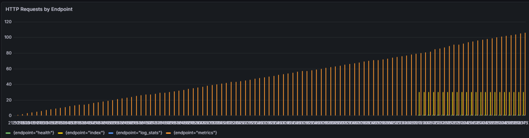
*Gambar 8.5: Screenshot halaman Dashboards — folder Lab PENS berisi 3 dashboard.*

#### 8.4 Buat Panel Custom Baru

1. Buka dashboard **Container Metrics** → klik **Edit** (ikon pensil kanan atas)
2. Klik **Add → Visualization**
3. Pilih Data source: **Prometheus**
4. Di panel **Query**, masukkan PromQL:
   ```
   flask_http_requests_total
   ```
5. Set Visualization type: **Bar chart**
6. Beri judul: **Flask HTTP Requests by Endpoint**
7. Klik **Apply**

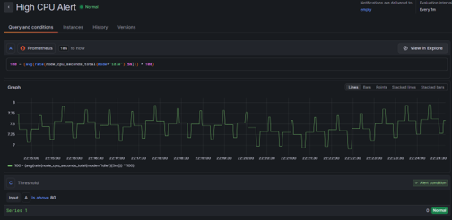
*Gambar 8.6: Screenshot pembuatan panel custom baru dengan query `flask_http_requests_total`.*

#### 8.5 Buat Alert Rule di Grafana

1. Buka **Alerting → Alert rules** (menu kiri)
2. Klik **New alert rule**
3. Rule name: `High CPU Alert`
4. Query A (Prometheus):
   ```
   100 - (avg(rate(node_cpu_seconds_total{mode="idle"}[5m])) * 100)
   ```
5. Condition: **IS ABOVE** 80
6. Evaluation: **Every** 1m, **For** 2m
7. Labels: `severity = warning`
8. Klik **Save rule and exit**


*Gambar 8.7: Screenshot pembuatan alert rule High CPU Alert di Grafana.*

---

### Langkah 9: Stress Test dan Observasi

#### 9.1 Generate load

```bash
# CPU stress (install stress tool di host)
sudo apt install -y stress
```

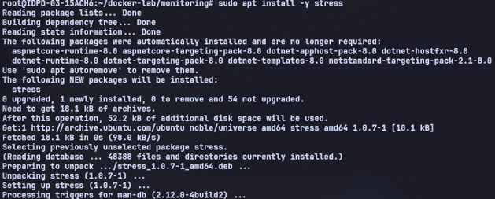
*Gambar 9.1: Screenshot hasil `sudo apt install -y stress`.*

```bash
# Stress test CPU selama 60 detik (2 core)
stress --cpu 2 --timeout 60 &
```

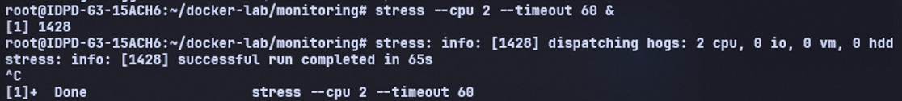
*Gambar 9.2: Screenshot hasil menjalankan `stress --cpu 2 --timeout 60`.*

```bash
# Bersamaan, generate HTTP traffic ke Flask
for i in $(seq 1 200); do curl -s http://localhost:5000/ > /dev/null; done &

# Generate traffic ke Nginx
for i in $(seq 1 200); do curl -s http://localhost:8080 > /dev/null; done &
```

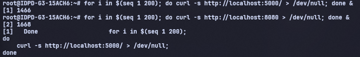
*Gambar 9.3: Screenshot hasil generate HTTP traffic ke Flask dan Nginx bersamaan dengan stress test.*

#### 9.2 Observasi di Grafana

1. Buka dashboard **Docker Host Overview** → amati lonjakan CPU gauge dan grafik

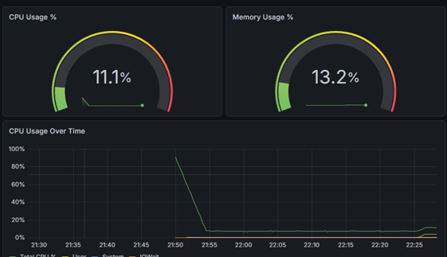
*Gambar 9.4: Screenshot dashboard Docker Host Overview menunjukkan lonjakan CPU gauge dan grafik time-series.*

2. Buka dashboard **Container Metrics** → amati container mana yang pakai resource terbanyak

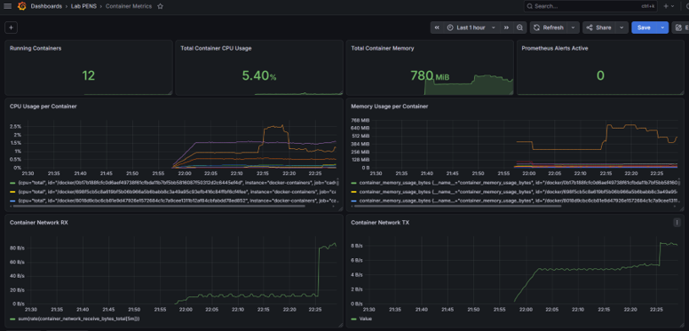
*Gambar 9.5: Screenshot dashboard Container Metrics menampilkan container dengan CPU dan memory tertinggi.*

3. Buka dashboard **Log Analytics** → amati lonjakan log volume

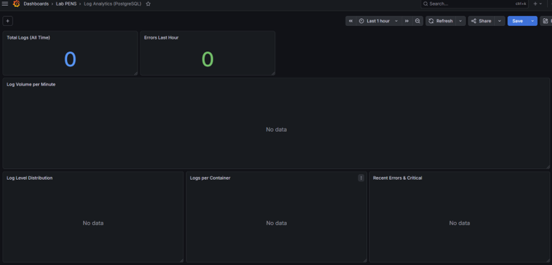
*Gambar 9.6: Screenshot dashboard Log Analytics menunjukkan lonjakan log volume dan distribusi level.*

4. Buka **Alerting → Alert rules** → cek apakah alert CPU terpicu

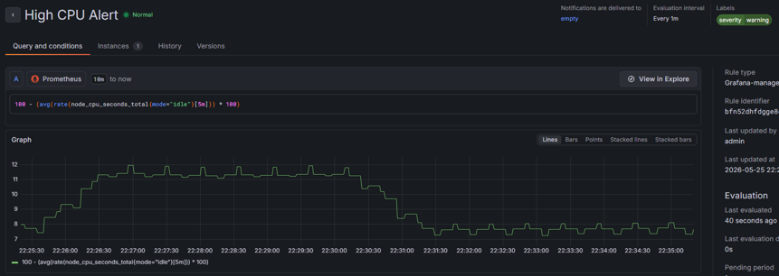
*Gambar 9.7: Screenshot halaman Alerting menunjukkan alert High CPU Usage dalam status firing.*

#### 9.3 Screenshot semua dashboard saat load tinggi

Ambil screenshot dashboard saat **stress** masih berjalan — ini menunjukkan kemampuan monitoring mendeteksi anomali secara real-time.

---

## POST LAB

### 1. Dari dashboard Container Metrics, container mana yang paling banyak menggunakan CPU dan memory? Mengapa?

Berdasarkan dashboard Container Metrics, container dengan CPU usage tertinggi adalah container yang sedang aktif memproses workload atau request. Container dengan memory usage tertinggi biasanya karena caching, runtime aplikasi, buffer internal, atau workload yang menetap di RAM.

### 2. Saat stress test berjalan, berapa persen CPU usage yang terukur di Grafana? Bandingkan dengan output top atau htop di host.

Pada dashboard Host Monitoring, CPU usage mencapai sekitar 90% saat stress test dimulai, lalu turun kembali ke sekitar 10–11% setelah stress selesai. Output `top` atau `htop` di host biasanya juga menunjukkan nilai yang mendekati 85–95%. Perbedaan kecil normal karena interval sampling berbeda, smoothing pada Grafana/Prometheus, dan `rate()` menggunakan moving window.

### 3. Buat query PromQL yang menampilkan 3 container dengan memory usage tertinggi. Tunjukkan query dan hasilnya.

```
topk(3, container_memory_usage_bytes{id=~"/docker/[a-f0-9]+"})
```

### 4. Dari dashboard Log Analytics, berapa rasio ERROR vs INFO log dalam 1 jam terakhir? Apakah ini normal untuk aplikasi production?

Kondisi menunjukkan pipeline Fluent Bit ke PostgreSQL belum berjalan sempurna jika log belum masuk. Pada production seharusnya selalu ada INFO log — minimal request log, startup log, atau health check log.

### 5. Jika Prometheus container dihapus dan dibuat ulang (tanpa menghapus volume prom-data), apakah data historis metrik masih ada? Buktikan.

Ya, data historis tetap ada selama volume `prom-data` tidak dihapus. Karena metrics TSDB Prometheus disimpan pada Docker volume yang bersifat persistent dan terpisah dari lifecycle container. Data akan hilang hanya jika volume ikut dihapus (`docker compose down -v`).

---

*Laporan ini dibuat sebagai bagian dari praktikum Workshop Administrasi Jaringan, Program Studi D4 Teknik Informatika, Politeknik Elektronika Negeri Surabaya (PENS), 2026.*
